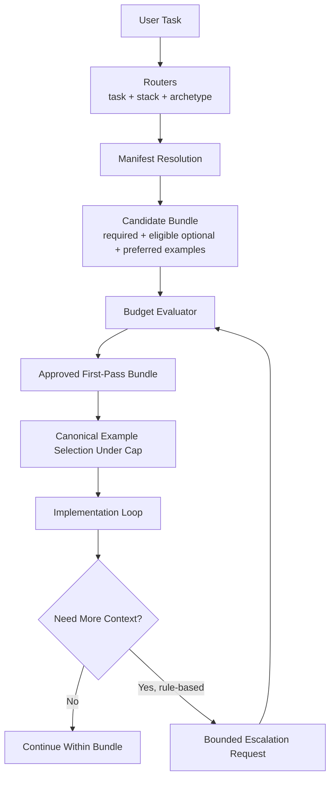

# Context Complexity Budget

The Context Complexity Budget is the control layer that sits between routing and loading.

Routers and manifests may propose context. The budget system decides what is actually allowed into the first-pass bundle, what is deferred, and when bounded escalation is justified.

This system is designed for this repository's real operating style:

- prompt-first repos
- backend APIs
- CLI tools
- local RAG systems
- data pipelines
- multi-storage experiments
- Docker-backed local infra with isolated dev and test stacks
- canonical-example-first implementation
- smoke-test-heavy delivery with minimal real-infra integration tests where boundaries matter

It must work for current first-class stacks such as FastAPI, Hono plus Bun plus Drizzle plus TSX, Rust plus Axum, Go plus Echo plus templ, Phoenix, and supporting storage and infra packs. It must also stay extension-friendly for later bounded additions such as Nim plus Jester plus HappyX, Zig plus Zap plus Jetzig, Scala plus Tapir plus http4s plus ZIO, Clojure plus Kit plus next.jdbc plus Hiccup, Kotlin plus http4k plus Exposed, Crystal plus Kemal plus Avram, OCaml plus Dream plus Caqti plus TyXML, and Dart Frog.

## SECTION 1 - Why A Context Complexity Budget Is Needed

Without a budget system, "load minimal context" degrades into style guidance rather than an enforceable control.

The failure modes are recurring:

- Context sprawl: assistants keep opening adjacent doctrine, similar workflows, extra stack packs, and multiple examples because each file looks individually useful.
- Cross-stack contamination: a FastAPI task absorbs Hono, Phoenix, or Axum patterns because the repo supports them somewhere.
- Excessive example loading: one route task ends up with API, smoke, integration, prompt, and deployment examples open together.
- False thoroughness: the assistant appears careful because it read many files, but it actually weakened pattern dominance and increased contradiction risk.
- Uncontrolled escalation: when the first bundle is weakly scoped, every ambiguity is treated as permission to load more files.
- Architecture hallucination: the assistant infers composite structures that are not present because it blended archetypes and stacks from neighboring manifests.
- Deployment leakage: Dokku doctrine or Compose isolation docs get loaded even when the task is purely local code or prompt work.

Examples in this repo:

- A paginated FastAPI endpoint should not load Phoenix route examples, Dokku doctrine, or multi-storage guidance unless the task explicitly activates those boundaries.
- A prompt-sequence task should not absorb backend API stack packs just because the repo also contains them.
- A Go Echo handler change with smoke tests should not open every testing workflow, every storage pack, and every canonical example category.
- A local RAG indexing task should prefer Qdrant plus local-rag-system context and should not quietly blend Elasticsearch or Meilisearch unless the task is comparative.

"Load minimal context" is insufficient because it is not measurable. A budget makes the policy executable:

- every artifact has a cost
- the bundle has hard caps
- uncertainty tightens the budget instead of loosening it
- escalation has explicit triggers, increments, and stop conditions

Minimal loading becomes policy only when the assistant can answer:

`Why was this file allowed?`
`What did it cost?`
`What was excluded?`
`What condition justified escalation?`

## SECTION 2 - Core Mental Model

The budget system operates on five layers:

1. Routers infer the dominant task, stack, and archetype.
2. Manifests propose candidate context bundles.
3. The budget evaluator scores candidate artifacts against a profile.
4. The evaluator emits one approved first-pass bundle.
5. Later expansion can happen only through bounded escalation.

Conceptual relationships:

- routers produce hypotheses
- manifests produce ordered candidate files
- metadata provides costs and tags
- the evaluator enforces profiles and hard caps
- approved context becomes the only first-pass load set

Formula-like mental model:

`R = route(task, repo_signals)`

`M = candidate_manifests(R)`

`C = union(required_context, conditionally_eligible_optional_context, preferred_examples)`

`cost(a) = base_type(a) + size(a) + modifiers(a)`

`bundle_cost(B) = sum(cost(a) for a in B) + bundle_penalties(B, R)`

`B0 = highest_priority_subset(C) where bundle_cost(B0) <= profile.max_points and hard_caps(B0) hold`

`Bk+1 = Bk + delta_k only if escalation_rule_k(Bk, delta_k, R) is true`

Short mental model:

`routers suggest`
`manifests enumerate`
`budgets approve`
`escalation is earned`

## SECTION 3 - System Architecture Diagram



How the diagram should be read:

- The user task does not go directly to file loading.
- Routers normalize the task into one dominant route.
- Manifest resolution proposes a broad but still structured candidate set.
- The candidate bundle is not yet approved. It is only a proposal.
- The budget evaluator is the enforcement point. It trims optional context, limits examples, enforces stack and archetype caps, and rejects cross-domain drift.
- The approved first-pass bundle is the only load set permitted before implementation starts.
- Canonical examples are selected under budget, not outside it.
- The implementation loop can request more context only through bounded escalation. That request returns to the evaluator rather than bypassing it.

This makes the budget system a runtime control gate, not a reporting feature.

## SECTION 4 - Budget Design Principles

The system should follow these principles:

- First-pass minimalism: the first pass should be intentionally incomplete but sufficient for the dominant task.
- Explicit cost model: every artifact class must have a default cost and explainable modifiers.
- Artifact classes are not equal: anchors, manifests, workflows, stack packs, and large examples impose different cognitive costs.
- Hard caps matter: even low-cost files can still create a high-diversity bundle.
- Escalation must be rule-based: "I want to be thorough" is not a valid reason.
- Multi-stack work costs more: secondary stacks are allowed only when the task activates them.
- Examples are powerful but limited: examples can dominate implementation style, so they must be capped more aggressively than doctrine.
- Confidence should tighten loading: lower routing confidence should reduce what is allowed, not encourage a broad scan.
- The budget must be explainable: a tool should be able to print why each file was included or excluded.
- Compatibility beats exhaustiveness: extension stacks should fit the metadata model without becoming part of first-pass defaults.
- Determinism over exploration: two assistants on the same task should converge on nearly the same first-pass bundle.

## SECTION 5 - Budget Dimensions

The evaluator should measure these dimensions.

### 1. File count

Why it matters:

- Too many small files still create context switching overhead.
- File count is the easiest guard against slow bundle creep.
- It catches bundle bloat that pure point totals can miss.

### 2. Estimated size or token size

Why it matters:

- Large files are more expensive even when they are relevant.
- Two doctrine files of very different length should not cost the same.
- Large examples can dominate the session disproportionately.

Recommended v1 approximation:

- use metadata `estimated_tokens`
- fall back to `ceil(byte_size / 4)` if metadata is absent

### 3. Artifact type

Why it matters:

- A workflow doc adds sequencing assumptions.
- A stack pack adds framework-specific rules.
- An example adds structural pattern pressure.
- Deployment doctrine adds operational boundaries.

Artifact type is the base of the scoring model.

### 4. Conceptual diversity

Why it matters:

- A bundle with API route, prompt orchestration, Dokku deploy, and multi-storage comparison concepts is more complex than a bundle with several tightly related API files.
- Diversity is a major source of cross-domain hallucination.

Recommended v1 measurement:

- count distinct `concept_tags`
- apply a penalty after the first four distinct tags

### 5. Stack count

Why it matters:

- Each additional stack pack introduces a competing implementation grammar.
- First-pass work should usually contain one primary application stack and at most one activated supporting stack.

### 6. Archetype count

Why it matters:

- Archetypes define project shape.
- A bundle that mixes `backend-api-service`, `prompt-first-repo`, and `multi-storage-experiment` will tend to invent composite architectures.

### 7. Example count

Why it matters:

- Examples have outsized influence.
- More than one example often means pattern blending unless the examples are orthogonal and intentionally paired.

### 8. Ambiguity

Why it matters:

- If routing ambiguity is high, the correct response is usually to stay narrow or stop, not to load more context.
- Ambiguity should consume available budget.

Recommended v1 scale:

- `0`: one dominant route
- `1`: minor uncertainty in workflow or support stack
- `2`: two plausible routes remain
- `3`: no safe dominant route; stop

### 9. Confidence

Why it matters:

- Confidence is the inverse signal of routing quality.
- Lower confidence should reduce effective budget and tighten caps.

Recommended v1 scale:

- `0.85-1.00`: strong route
- `0.70-0.84`: usable but constrained
- `0.55-0.69`: weak; no optional examples and no second workflow
- `< 0.55`: do not assemble a bundle yet

### 10. Change surface area

Why it matters:

- A one-file route change should not receive the same budget as a route plus storage plus smoke plus deployment change.
- This dimension is about task breadth, not file length.

Recommended v1 buckets:

- `1`: single surface
- `2`: surface plus one adjacent boundary
- `3`: service plus verification or storage
- `4`: multi-boundary or cross-system change

## SECTION 6 - Cost Model

The scoring model should be simple enough to reason about by inspection.

### 6.1 Base Costs By Artifact Type

| Artifact Type | Base Cost | Notes |
| --- | ---: | --- |
| `anchor` | 1 | Boot anchors are usually outside the task budget; task-specific anchors count here. |
| `manifest` | 2 | One selected manifest should almost always be present. |
| `doctrine` | 3 | Stable rules, moderate cognitive weight. |
| `workflow` | 3 | Adds task sequencing and verification posture. |
| `stack_pack` | 4 | High leverage and high contamination risk. |
| `archetype_pack` | 4 | Defines repo shape and constraints. |
| `canonical_example` | 4 | Strong implementation influence. |
| `large_example` | 7 | Use when example token size exceeds large threshold. |
| `validation_script_reference` | 2 | Lightweight if cited for verification only. |
| `deployment_doctrine` | 4 | Operationally dense; load only on explicit trigger. |

### 6.2 Size Cost

Use a small additive size term:

`size_cost(a) = max(0, ceil(estimated_tokens(a) / 400) - 1)`

Interpretation:

- up to 400 tokens: `0`
- 401-800: `1`
- 801-1200: `2`
- cap at `4` in v1

This keeps type dominant while still discouraging oversized docs or examples.

### 6.3 Modifiers

Recommended modifiers:

- `direct_match_discount = -1`
  - artifact explicitly matches the active workflow, stack, or archetype
- `preferred_example_discount = -1`
  - artifact is manifest-preferred and ranked first for the active task
- `direct_manifest_required_discount = -1`
  - artifact is in `required_context`
- `cross_domain_penalty = +2`
  - artifact introduces concepts outside the dominant route
- `secondary_stack_penalty = +2`
  - artifact belongs to the first supporting stack
- `third_stack_penalty = +4`
  - artifact belongs to any stack beyond the first support stack
- `extra_archetype_penalty = +3`
  - artifact implies a second archetype in first pass
- `ambiguity_penalty = +2 * ambiguity_level`
  - task-level penalty
- `confidence_penalty = 0 | 2 | 4`
  - `0` for `>= 0.85`
  - `2` for `0.70-0.84`
  - `4` for `0.55-0.69`
- `change_surface_penalty = change_surface_area - 1`
  - task-level penalty
- `deployment_without_trigger_penalty = +4`
  - Dokku or deployment doctrine loaded without explicit deployment trigger
- `large_example_penalty = +2`
  - applied on top of `large_example` when example is not the primary example

### 6.4 Artifact Formula

`artifact_cost(a) = base_cost(type(a)) + size_cost(a) + modifiers(a)`

### 6.5 Bundle Formula

`bundle_cost(B) = sum(artifact_cost(a) for a in B) + ambiguity_penalty + confidence_penalty + change_surface_penalty + diversity_penalty(B)`

Recommended v1 diversity penalty:

`diversity_penalty(B) = max(0, distinct_concept_tags(B) - 4)`

### 6.6 Example

A direct-match FastAPI workflow file:

- workflow base `3`
- size `0`
- direct match `-1`
- required context `-1`

`artifact_cost = 1`

A secondary storage stack pack for DuckDB plus Polars:

- stack base `4`
- size `1`
- secondary stack penalty `+2`
- direct match `-1`

`artifact_cost = 6`

The result is intentional:

- dominant-route files are cheap
- support-stack files are allowed but expensive
- drift costs more than direct relevance

## SECTION 7 - Hard Caps

Point scoring is necessary but not sufficient. Hard caps prevent many small but diverse files from slipping through.

Recommended first-pass hard caps:

- maximum stacks: `1` primary plus `1` support stack for most profiles
- maximum archetypes: `1` for tiny through medium, `2` only for large or cross-system
- maximum workflows: `1` for tiny and small, `2` for medium and above
- maximum examples: `1` for tiny through medium, `2` only for large or cross-system
- maximum total files: profile-specific, regardless of score
- maximum deployment docs without deployment trigger: `0`
- maximum large examples: `1`
- maximum validation script references: `1`

Why hard caps are necessary:

- A scoring system alone can still approve ten small files from too many domains.
- Cross-stack contamination often comes from count rather than cost.
- Example blending is better prevented by absolute ceilings than by gradually rising prices.
- Hard caps make tool output easy to explain: "rejected because this would be the third stack" is clearer than "rejected because score drifted upward."

## SECTION 8 - Budget Profiles

Profiles should be small in number and easy to recognize.

### 8.1 Tiny

Use for narrowly scoped questions, one-file fixes, or direct answers.

```yaml
name: tiny
max_points: 9
max_files: 4
max_stacks: 1
max_archetypes: 1
max_workflows: 1
max_examples: 0
max_large_examples: 0
escalation:
  max_rounds: 0
  increment_points: 0
  increment_files: 0
  allowed_reason_codes: []
intended_tasks:
  - explain a single route surface
  - narrow bug fix
  - single-file refactor
```

### 8.2 Small

Use for one dominant workflow on one stack with one archetype.

```yaml
name: small
max_points: 15
max_files: 6
max_stacks: 1
max_archetypes: 1
max_workflows: 1
max_examples: 1
max_large_examples: 0
escalation:
  max_rounds: 1
  increment_points: 4
  increment_files: 1
  allowed_reason_codes:
    - missing_verification_pattern
    - missing_boundary_detail
intended_tasks:
  - add a simple API endpoint
  - extend a CLI command
  - generate a prompt sequence in an already-routed repo
```

### 8.3 Medium

Use for one dominant workflow plus one adjacent boundary such as storage or smoke tests.

```yaml
name: medium
max_points: 22
max_files: 8
max_stacks: 2
max_archetypes: 1
max_workflows: 2
max_examples: 1
max_large_examples: 1
escalation:
  max_rounds: 1
  increment_points: 6
  increment_files: 2
  allowed_reason_codes:
    - failed_smoke_boundary
    - missing_storage_contract
    - missing_verification_pattern
intended_tasks:
  - add an endpoint plus smoke tests
  - local RAG indexing config
  - route plus storage integration
```

### 8.4 Large

Use for broader but still single-system work: deployment, data-pipeline boundaries, or multi-step implementation work.

```yaml
name: large
max_points: 32
max_files: 10
max_stacks: 2
max_archetypes: 2
max_workflows: 2
max_examples: 2
max_large_examples: 1
escalation:
  max_rounds: 2
  increment_points: 7
  increment_files: 2
  allowed_reason_codes:
    - failed_real_boundary_test
    - missing_deployment_contract
    - missing_secondary_workflow
intended_tasks:
  - add Dokku support
  - extend Go service with smoke and minimal real-infra testing
  - update a data-pipeline boundary
```

### 8.5 Cross-System

Use only for explicitly comparative or intentionally polyglot tasks.

```yaml
name: cross-system
max_points: 45
max_files: 14
max_stacks: 3
max_archetypes: 2
max_workflows: 3
max_examples: 2
max_large_examples: 1
escalation:
  max_rounds: 2
  increment_points: 8
  increment_files: 2
  allowed_reason_codes:
    - explicit_comparison_task
    - unresolved_cross_backend_contract
    - missing_experiment_control
intended_tasks:
  - multi-storage experiment update
  - polyglot lab comparison
  - meta-repo budget or routing work
```

Profile selection rule of thumb:

- default to `small`
- upgrade to `medium` when one adjacent boundary is clearly active
- upgrade to `large` only for deployment or broader cross-boundary implementation
- use `cross-system` only when the task itself is cross-system

## SECTION 9 - Artifact Metadata Strategy

The evaluator needs metadata to score artifacts without reading everything first.

Two practical approaches:

### Approach A - Sidecar Metadata Files

Example:

- `context/workflows/add-api-endpoint.meta.yaml`
- `examples/canonical-api/fastapi-endpoint-example.meta.yaml`

Advantages:

- metadata lives next to the artifact
- easier local editing when touching one artifact

Disadvantages:

- doubles file count
- encourages metadata drift in broad refactors
- makes validation and ranking scans more expensive

### Approach B - Central Registry Files

Example:

- `context/metadata/context-artifacts.yaml`
- `examples/metadata/example-artifacts.yaml`

Advantages:

- easier to lint and diff
- easy for evaluators to load once
- lower authoring overhead in a prompt-first repo
- matches the current repo habit of central catalogs such as `examples/catalog.json` and `context/context-weights.json`

Disadvantages:

- metadata is not physically adjacent to the source file
- large registries can become unwieldy if not kept structured

### Recommendation For v1

Use central registries for v1.

Why:

- this repo already uses central machine-readable surfaces for weights and example ranking
- central registries are simpler to validate with lightweight scripts
- the budget evaluator needs one-pass loading, not many sidecar reads
- v1 is a policy layer; consistency matters more than perfect locality

### 9.1 Context Artifact Metadata Schema

Recommended schema:

```yaml
artifacts:
  - path: context/workflows/add-api-endpoint.md
    artifact_type: workflow
    estimated_tokens: 320
    stacks: []
    archetypes: [backend-api-service, dokku-deployable-service]
    workflows: [add-api-endpoint]
    concepts: [http-route, verification]
    stability: stable
    direct_match_fields: [workflows, archetypes]
    load_phase: first_pass
    notes: Primary route-addition workflow.
```

Recommended fields:

- `path`
- `artifact_type`
- `estimated_tokens`
- `stacks`
- `archetypes`
- `workflows`
- `concepts`
- `stability`
- `load_phase`
- `preferred_for`
- `forbidden_without`
- `large_artifact`
- `notes`

### 9.2 Example Artifact Metadata Schema

Recommended schema:

```yaml
examples:
  - path: examples/canonical-api/fastapi-endpoint-example.py
    artifact_type: canonical_example
    estimated_tokens: 220
    stacks: [python-fastapi-uv-ruff-orjson-polars]
    archetypes: [backend-api-service, dokku-deployable-service]
    workflows: [add-api-endpoint]
    concepts: [http-route, json-response, service-boundary]
    example_family: api
    preferred_rank: 1
    orthogonal_with: [examples/canonical-smoke-tests/fastapi-smoke-test-example.py]
    forbidden_with: [examples/canonical-api/typescript-hono-handler-example.ts]
    notes: Dominant FastAPI route example.
```

### 9.3 Example Metadata Entries

Workflow doc:

```yaml
artifacts:
  - path: context/workflows/add-storage-integration.md
    artifact_type: workflow
    estimated_tokens: 430
    stacks: []
    archetypes: [backend-api-service, data-pipeline, multi-storage-experiment]
    workflows: [add-storage-integration]
    concepts: [storage-boundary, integration-test]
    stability: stable
    load_phase: first_pass
    notes: Storage work and minimal real-infra verification guidance.
```

Stack pack:

```yaml
artifacts:
  - path: context/stacks/typescript-hono-bun.md
    artifact_type: stack_pack
    estimated_tokens: 560
    stacks: [typescript-hono-bun]
    archetypes: [backend-api-service, dokku-deployable-service]
    workflows: [add-api-endpoint, add-smoke-tests, add-deployment-support]
    concepts: [http-route, bun-runtime, drizzle, tsx]
    stability: stable
    load_phase: first_pass
    notes: Primary Bun backend guidance.
```

Canonical API example:

```yaml
examples:
  - path: examples/canonical-api/go-echo-handler-example.go
    artifact_type: canonical_example
    estimated_tokens: 210
    stacks: [go-echo]
    archetypes: [backend-api-service, dokku-deployable-service]
    workflows: [add-api-endpoint]
    concepts: [http-route, json-response]
    example_family: api
    preferred_rank: 1
    notes: Preferred Echo handler pattern.
```

Prompt-first example:

```yaml
examples:
  - path: examples/canonical-prompts/prompt-first-layout-example.md
    artifact_type: canonical_example
    estimated_tokens: 260
    stacks: [prompt-first-repo]
    archetypes: [prompt-first-repo]
    workflows: [generate-prompt-sequence, bootstrap-repo]
    concepts: [prompt-layout, monotonic-numbering]
    example_family: prompt
    preferred_rank: 1
    notes: Prompt-file organization and numbering pattern.
```

Dokku deployment example:

```yaml
examples:
  - path: examples/canonical-dokku/Procfile.example
    artifact_type: canonical_example
    estimated_tokens: 120
    stacks: [python-fastapi-uv-ruff-orjson-polars, typescript-hono-bun, go-echo, elixir-phoenix]
    archetypes: [dokku-deployable-service]
    workflows: [add-deployment-support]
    concepts: [procfile, release-phase]
    example_family: deployment
    preferred_rank: 1
    forbidden_without: [context/stacks/dokku-conventions.md]
    notes: Shared Dokku boot surface.
```

## SECTION 10 - First-Pass Bundle Assembly

The first-pass assembly algorithm should be deterministic.

### Step 1 - Candidate proposal

Inputs:

- routed workflow
- routed archetype
- routed primary stack
- activated supporting stacks
- selected manifest
- repo signals
- chosen budget profile

Candidate files come from:

- selected manifest file itself
- `required_context`
- only the `optional_context` whose tags match the active workflow, stack, archetype, or boundary flags
- manifest `preferred_examples`
- zero or one task-specific anchor if metadata work or Compose isolation is active

### Step 2 - Eligibility filtering

Before scoring, remove files that fail hard eligibility rules:

- optional workflow does not match the active task or an explicitly activated adjacent boundary
- stack pack does not match the active implementation surface
- deployment doctrine without deployment trigger
- examples outside the active workflow family
- examples forbidden with the current primary example or active stack

### Step 3 - Scoring

For each eligible file:

- resolve metadata
- compute `artifact_cost`
- compute `priority_score`

Recommended priority score:

`priority(a) = 5 if manifest_file`
`+ 4 if required_context`
`+ 3 if direct workflow match`
`+ 3 if direct stack match`
`+ 2 if direct archetype match`
`+ preferred_rank_bonus`
`- cross_domain_penalty`

The evaluator should sort by:

1. requiredness
2. priority descending
3. cost ascending
4. path for deterministic tie-breaking

### Step 4 - Greedy approval under caps

Build the bundle in this order:

1. selected manifest
2. required context in manifest order, skipping anything that violates profile hard caps only if the manifest is itself invalid for the chosen profile
3. optional context by priority and cost
4. examples last, under example caps

If required context already exceeds the profile, the evaluator should:

- attempt the next larger profile only if routing confidence is strong and the task size justifies it
- otherwise stop and emit `manifest_over_budget_for_task`

### Step 5 - Low-value trimming

When the candidate set exceeds budget:

- drop optional examples first
- then drop optional workflows
- then drop optional support stacks
- then drop optional doctrine
- never trim required context silently

### Step 6 - Canonical example choice under cap

Example selection should be constrained:

- choose one primary example from the manifest preferred list or ranked catalog
- allow one orthogonal support example only if the profile allows two examples and the second example belongs to a different family such as `api` plus `smoke-test`
- never allow two examples from different application stacks in the first pass

### Step 7 - Final approved bundle

The evaluator emits:

- profile used
- total points
- total files
- stack count
- archetype count
- workflow count
- example count
- approved paths in load order
- excluded paths with reasons

The approved bundle becomes authoritative for first-pass loading.

## SECTION 11 - Bounded Escalation Policy

Escalation is a controlled second pass, not a continuation of exploratory reading.

### 11.1 Conditions That Allow Escalation

Escalation is allowed only when one of these conditions is true:

- a failing smoke test or integration test reveals a missing boundary contract
- implementation reached a declared boundary not covered by the first-pass bundle
- the first-pass example is insufficient for the active stack and a closer example exists
- deployment or isolation work became explicit during execution
- the user broadened the task

Invalid reasons:

- "for completeness"
- "maybe helpful"
- "I want more examples"
- "the repo is large"

### 11.2 Escalation Amount

Each profile defines:

- `max_rounds`
- `increment_points`
- `increment_files`

Escalation adds both a point allowance and a file allowance. It does not lift stack or archetype caps unless the profile says so.

### 11.3 Maximum Number Of Escalations

Recommended:

- `tiny`: `0`
- `small`: `1`
- `medium`: `1`
- `large`: `2`
- `cross-system`: `2`

### 11.4 Required Escalation Explanation

Every escalation note should include:

- current profile and usage
- triggering condition
- requested files
- added points
- expected question the new files answer
- why existing bundle is insufficient

### 11.5 When Escalation Must Stop

Stop escalation when:

- max rounds are exhausted
- routing confidence falls below the stop threshold
- requested files would introduce a disallowed second archetype or third stack
- the new request is actually a task change and needs rerouting
- the requested artifact is only broadly related and not boundary-specific

### 11.6 Example Escalation Notes

Example 1:

```text
Escalation 1 of 1 for medium profile.
Trigger: failed smoke boundary while adding FastAPI pagination.
Request: context/workflows/add-smoke-tests.md, examples/canonical-smoke-tests/fastapi-smoke-test-example.py
Added budget: +6 points, +2 files.
Why: first-pass bundle covered endpoint shape but not the repo's preferred smoke-test verification surface.
```

Example 2:

```text
Escalation 1 of 2 for large profile.
Trigger: deployment became explicit after adding Dokku support.
Request: context/doctrine/deployment-philosophy-dokku.md, examples/canonical-dokku/Procfile.example
Added budget: +7 points, +2 files.
Why: current bundle covered service stack and workflow, but not release-phase and Procfile contract details.
```

## SECTION 12 - Example Task Walkthroughs

The numbers below are approximate. They show how the evaluator behaves, not an exact byte-accurate calculation.

### 12.1 Add paginated FastAPI endpoint

- Inference: workflow `add-api-endpoint`, archetype `backend-api-service`, stack `python-fastapi-uv-ruff-orjson-polars`
- Profile: `small`
- Candidate files:
  - `manifests/backend-api-fastapi-polars.yaml`
  - `context/workflows/add-api-endpoint.md`
  - `context/stacks/python-fastapi-uv-ruff-orjson-polars.md`
  - `context/archetypes/backend-api-service.md`
  - `context/doctrine/core-principles.md`
  - `context/doctrine/testing-philosophy.md`
  - `examples/canonical-api/fastapi-endpoint-example.py`
  - optional `context/workflows/add-smoke-tests.md`
- Approximate scoring:
  - manifest `1`
  - workflow `1`
  - stack `3`
  - archetype `3`
  - doctrine core `2`
  - doctrine testing `2`
  - example `3`
  - optional smoke workflow `3`
  - total without smoke `15`
- Approved first pass:
  - manifest
  - `context/doctrine/core-principles.md`
  - `context/workflows/add-api-endpoint.md`
  - `context/stacks/python-fastapi-uv-ruff-orjson-polars.md`
  - `context/archetypes/backend-api-service.md`
  - `examples/canonical-api/fastapi-endpoint-example.py`
- Escalation: no

### 12.2 Add HTMX-friendly TypeScript Hono route

- Inference: workflow `add-api-endpoint`, archetype `backend-api-service`, stack `typescript-hono-bun`
- Profile: `small`
- Candidate files:
  - `manifests/backend-api-typescript-hono-bun.yaml`
  - `context/workflows/add-api-endpoint.md`
  - `context/stacks/typescript-hono-bun.md`
  - `context/archetypes/backend-api-service.md`
  - `context/doctrine/core-principles.md`
  - `examples/canonical-api/typescript-hono-handler-example.ts`
- Approximate scoring: total `14`
- Approved first pass:
  - manifest
  - core doctrine
  - add-api-endpoint workflow
  - Hono stack pack
  - backend-api archetype
  - Hono example
- Escalation: no

### 12.3 Extend Go Echo templ handler with smoke tests and database integration tests

- Inference: workflows `add-api-endpoint` plus `add-storage-integration`, archetype `backend-api-service`, stack `go-echo`
- Profile: `large`
- Candidate files:
  - `manifests/backend-api-go-echo.yaml`
  - `context/workflows/add-api-endpoint.md`
  - `context/workflows/add-storage-integration.md`
  - `context/workflows/add-smoke-tests.md`
  - `context/stacks/go-echo.md`
  - `context/archetypes/backend-api-service.md`
  - `context/doctrine/testing-philosophy.md`
  - `examples/canonical-api/go-echo-handler-example.go`
- Approximate scoring:
  - manifest `1`
  - endpoint workflow `1`
  - storage workflow `2`
  - smoke workflow `3`
  - stack `3`
  - archetype `3`
  - testing doctrine `2`
  - example `3`
  - total `18`
- Approved first pass:
  - manifest
  - testing doctrine
  - add-api-endpoint workflow
  - add-storage-integration workflow
  - go-echo stack pack
  - backend-api archetype
  - go-echo example
- Escalation: maybe one escalation for `add-smoke-tests.md` if smoke verification shape becomes active during implementation

### 12.4 Add Phoenix route and controller flow

- Inference: workflow `add-api-endpoint`, archetype `backend-api-service`, stack `elixir-phoenix`
- Profile: `small`
- Candidate files:
  - `manifests/webapp-elixir-phoenix.yaml`
  - `context/workflows/add-api-endpoint.md`
  - `context/stacks/elixir-phoenix.md`
  - `context/archetypes/backend-api-service.md`
  - `examples/canonical-api/phoenix-route-controller-example.ex`
  - `examples/canonical-api/phoenix-router-surface-example.ex`
- Approximate scoring:
  - first example `3`
  - second example would exceed example cap and add pattern overlap
  - total approved `15`
- Approved first pass:
  - manifest
  - add-api-endpoint workflow
  - Phoenix stack pack
  - backend-api archetype
  - `examples/canonical-api/phoenix-route-controller-example.ex`
- Escalation: no; router-surface example only if controller example proves insufficient

### 12.5 Generate prompt sequence

- Inference: workflow `generate-prompt-sequence`, archetype `prompt-first-repo`, stack `prompt-first-repo`
- Profile: `small`
- Candidate files:
  - `manifests/prompt-first-meta-repo.yaml`
  - `context/workflows/generate-prompt-sequence.md`
  - `context/stacks/prompt-first-repo.md`
  - `context/archetypes/prompt-first-repo.md`
  - `context/doctrine/prompt-first-conventions.md`
  - `examples/canonical-prompts/001-bootstrap-repo.txt`
  - `examples/canonical-prompts/prompt-first-layout-example.md`
- Approximate scoring:
  - prompt doctrine `2`
  - one prompt example `3`
  - second example rejected by cap
  - total `14`
- Approved first pass:
  - manifest
  - prompt-first conventions doctrine
  - generate-prompt-sequence workflow
  - prompt-first stack pack
  - prompt-first archetype
  - `examples/canonical-prompts/prompt-first-layout-example.md`
- Escalation: no

### 12.6 Add local RAG indexing config

- Inference: workflow `add-local-rag-indexing`, archetype `local-rag-system`, stack `qdrant`
- Profile: `medium`
- Candidate files:
  - `manifests/local-rag-base.yaml`
  - `context/workflows/add-local-rag-indexing.md`
  - `context/stacks/qdrant.md`
  - `context/archetypes/local-rag-system.md`
  - `context/doctrine/compose-port-and-data-isolation.md`
  - `examples/canonical-rag/local-rag-index-config-example.yaml`
  - `examples/canonical-rag/local-rag-metadata-shape-example.md`
  - optional `context/stacks/meilisearch.md`
- Approximate scoring:
  - manifest `1`
  - workflow `1`
  - qdrant stack `3`
  - archetype `3`
  - isolation doctrine `2`
  - primary example `3`
  - second example rejected on example cap
  - Meilisearch stack rejected on cross-domain penalty
  - total `13`
- Approved first pass:
  - manifest
  - add-local-rag-indexing workflow
  - qdrant stack pack
  - local-rag archetype
  - compose isolation doctrine
  - local-rag index config example
- Escalation: maybe one escalation if metadata shape questions remain

### 12.7 Add DuckDB plus Polars integration

- Inference: workflow `add-storage-integration`, archetype `data-pipeline` or `backend-api-service` depending repo signals, stacks `python-fastapi-uv-ruff-orjson-polars` plus `duckdb-trino-polars`
- Profile: `medium`
- Candidate files:
  - `manifests/data-pipeline-polars.yaml`
  - `context/workflows/add-storage-integration.md`
  - `context/stacks/duckdb-trino-polars.md`
  - `context/stacks/python-fastapi-uv-ruff-orjson-polars.md`
  - `context/archetypes/data-pipeline.md`
  - `examples/canonical-storage/duckdb-polars-example.py`
  - `examples/canonical-seed-data/polars-seed-data-example.py`
- Approximate scoring:
  - primary storage stack `3`
  - supporting Python service stack `6`
  - archetype `3`
  - storage example `3`
  - seed example rejected in first pass
  - total `18`
- Approved first pass:
  - manifest
  - add-storage-integration workflow
  - duckdb-trino-polars stack pack
  - data-pipeline archetype
  - duckdb-polars example
  - Python service stack only if repo signals show FastAPI service boundary
- Escalation: no if pure data pipeline; yes if service API boundary is confirmed later

### 12.8 Refactor Rust Axum route surface

- Inference: workflow `refactor`, archetype `backend-api-service`, stack `rust-axum-modern`
- Profile: `tiny`
- Candidate files:
  - `manifests/backend-api-rust-axum.yaml`
  - `context/workflows/refactor.md`
  - `context/stacks/rust-axum-modern.md`
  - `context/archetypes/backend-api-service.md`
  - `examples/canonical-api/rust-axum-route-example.rs`
- Approximate scoring:
  - manifest `1`
  - refactor workflow `2`
  - stack `3`
  - archetype `3`
  - example would exceed tiny profile
  - total `9`
- Approved first pass:
  - manifest
  - refactor workflow
  - Rust stack pack
  - backend-api archetype
- Escalation: none in `tiny`; if exact route pattern is needed, profile should be reselected as `small`

### 12.9 Add Dokku support to a service

- Inference: workflow `add-deployment-support`, archetype `dokku-deployable-service`, stack `dokku-conventions` plus active service stack
- Profile: `large`
- Candidate files:
  - `manifests/dokku-deployable-fastapi.yaml`
  - `context/workflows/add-deployment-support.md`
  - `context/stacks/dokku-conventions.md`
  - `context/stacks/python-fastapi-uv-ruff-orjson-polars.md`
  - `context/archetypes/dokku-deployable-service.md`
  - `context/doctrine/deployment-philosophy-dokku.md`
  - `context/doctrine/compose-port-and-data-isolation.md`
  - `examples/canonical-dokku/Procfile.example`
  - `examples/canonical-dokku/app-json-example.json`
- Approximate scoring:
  - manifest `1`
  - deployment workflow `1`
  - Dokku stack `3`
  - service stack `6`
  - archetype `3`
  - deployment doctrine `3`
  - isolation doctrine `2`
  - primary Dokku example `3`
  - second Dokku example `4`
  - total `26`
- Approved first pass:
  - manifest
  - add-deployment-support workflow
  - dokku-conventions stack
  - active service stack
  - dokku-deployable-service archetype
  - deployment philosophy doctrine
  - `examples/canonical-dokku/Procfile.example`
- Escalation: one escalation for `app-json-example.json` if app metadata becomes active

### 12.10 Extend CLI command

- Inference: workflow `extend-cli`, archetype `cli-tool`, stack inferred from repo, often Python
- Profile: `small`
- Candidate files:
  - `manifests/cli-python.yaml`
  - `context/workflows/extend-cli.md`
  - `context/archetypes/cli-tool.md`
  - `examples/canonical-cli/python-cli-command-example.py`
  - optional stack pack if CLI lives in FastAPI-adjacent repo
- Approximate scoring: `12-15`
- Approved first pass:
  - manifest
  - extend-cli workflow
  - cli-tool archetype
  - Python CLI example
  - stack pack only if the command shares runtime constraints with the primary app
- Escalation: no

### 12.11 Update multi-storage experiment

- Inference: workflow `add-storage-integration`, archetype `multi-storage-experiment`, stacks `redis-keydb-mongo` plus one explicitly compared backend
- Profile: `cross-system`
- Candidate files:
  - `manifests/multi-storage-zoo.yaml`
  - `context/workflows/add-storage-integration.md`
  - `context/archetypes/multi-storage-experiment.md`
  - `context/stacks/redis-keydb-mongo.md`
  - one of `context/stacks/elasticsearch.md`, `context/stacks/qdrant.md`, `context/stacks/timescaledb.md`, `context/stacks/meilisearch.md`
  - `context/doctrine/compose-port-and-data-isolation.md`
  - `examples/canonical-storage/redis-mongo-shape-example.md`
  - optional second example for the compared backend family
- Approximate scoring:
  - base path `14-18`
  - add compared backend stack `6`
  - add second example `4`
  - total `24-29`
- Approved first pass:
  - manifest
  - add-storage-integration workflow
  - multi-storage archetype
  - redis-keydb-mongo stack
  - exactly one compared backend stack
  - compose isolation doctrine
  - redis-mongo shape example
- Escalation: allowed only if the task explicitly compares a second backend in the same pass

## SECTION 13 - Integration With Boot Sequence

The budget evaluator should be inserted into the current Context Boot Sequence after manifest resolution and before bundle assembly.

Updated boot sequence:

1. read boot anchors
2. detect repo signals
3. interpret task
4. consult routers
5. resolve manifest
6. evaluate context budget
7. assemble approved first-pass bundle
8. load canonical example under cap
9. begin implementation loop

Important detail:

- Stage 0 boot anchors remain a fixed startup allowance and do not count against the task profile.
- The task budget starts when manifest-driven candidate context is assembled.

Deterministic startup behavior:

- routers infer
- manifest proposes
- budget approves
- implementation begins only after approval

The boot sequence should record:

- selected profile
- route confidence
- ambiguity level
- approved bundle summary
- rejected optional files

This makes budget approval part of assistant startup state, not a hidden heuristic.

## SECTION 14 - Integration With AGENT.md, CLAUDE.md, And The Operating Manual

These high-level documents should give short operational instructions, not restate the full doctrine.

Recommended `AGENT.md` wording:

```md
Use the Context Complexity Budget before loading manifest context.
Routers and manifests may propose candidate files, but only the budget-approved first-pass bundle may be loaded initially.
Do not open extra stack packs, workflows, or examples unless a bounded escalation rule is satisfied.
Prefer one dominant example and one dominant workflow in the first pass.
```

Recommended `CLAUDE.md` wording:

```md
Treat context loading as budgeted, not exploratory.
After routing and manifest selection, run the budget evaluator or apply the documented profile rules before reading optional context.
If the selected bundle is insufficient, record a bounded escalation reason instead of broadening context informally.
```

Recommended operating-manual wording:

```md
The budget system is the enforcement layer between routing and loading.
Manifest bundles are proposals, not automatic load sets.
Assistants must be able to explain why each first-pass file was admitted, what it cost, and why excluded files were deferred.
Budget violations are behavior bugs because they weaken determinism and increase architecture drift.
```

## SECTION 15 - Recommended Files And Directory Layout

Recommended additions:

- `context/doctrine/context-complexity-budget.md`
  - the human-readable policy and scoring rules
- `context/budgets/tiny.yaml`
  - tiny profile defaults
- `context/budgets/small.yaml`
  - small profile defaults
- `context/budgets/medium.yaml`
  - medium profile defaults
- `context/budgets/large.yaml`
  - large profile defaults
- `context/budgets/cross-system.yaml`
  - cross-system profile defaults
- `context/metadata/context-artifacts.yaml`
  - central metadata for doctrine, workflows, stacks, archetypes, anchors, and validation-script references
- `examples/metadata/example-artifacts.yaml`
  - central metadata for canonical examples
- `scripts/evaluate_context_budget.py`
  - machine-readable approval engine
- `scripts/explain_context_budget.py`
  - human-readable explanation and debug output

Recommended relationships:

- profiles define caps and escalation increments
- metadata defines costs and tags
- the evaluator scores candidate artifacts
- the explainer turns evaluation state into readable output

Compatibility note:

- keep `context/context-weights.json` as a compatibility hint surface in v1
- use the new metadata registries as the authoritative budget inputs
- later, the weight file can be simplified or derived

## SECTION 16 - Evaluator And Explainer Script Design

### 16.1 `evaluate_context_budget.py`

Purpose:

- take routed task and manifest candidates
- score context artifacts
- emit the approved first-pass bundle or a stop decision

Expected inputs:

- manifest name or path
- selected budget profile
- task name
- stack names
- archetype names
- ambiguity level
- confidence score
- optional repo signal summary
- optional escalation request payload

Suggested CLI:

```bash
python scripts/evaluate_context_budget.py \
  --manifest backend-api-fastapi-polars \
  --profile small \
  --task add-api-endpoint \
  --stack python-fastapi-uv-ruff-orjson-polars \
  --archetype backend-api-service \
  --confidence 0.91 \
  --ambiguity 0
```

Suggested outputs:

- JSON by default for tool integration
- fields:
  - `approved`
  - `profile`
  - `effective_points`
  - `effective_file_cap`
  - `summary`
  - `approved_bundle`
  - `excluded_artifacts`
  - `hard_cap_violations`
  - `requires_stop`
  - `escalation_allowed`

Integration points:

- `preview_context_bundle.py` should call it before printing bundle previews
- router preview tools can use it to show "candidate vs approved"
- manifest validation can optionally check that required context is not pathological under its intended profiles

Maintainability requirements:

- keep metadata parsing separate from scoring
- keep modifier logic in small pure functions
- keep profile loading declarative
- expose one deterministic evaluation function for tests

### 16.2 `explain_context_budget.py`

Purpose:

- turn evaluator results into readable human output
- help authors understand why files were admitted or excluded

Suggested CLI:

```bash
python scripts/explain_context_budget.py \
  --manifest local-rag-base \
  --profile medium \
  --task add-local-rag-indexing \
  --stack qdrant \
  --archetype local-rag-system \
  --confidence 0.88 \
  --ambiguity 0
```

Suggested outputs:

- table of candidate artifacts with:
  - type
  - estimated tokens
  - base cost
  - modifiers
  - final cost
  - decision
  - rationale
- bundle summary:
  - stacks
  - workflows
  - archetypes
  - examples
  - total points
- suggested escalation paths if relevant

Integration points:

- invoked by humans during policy tuning
- used in CI snapshots for representative manifests
- used by `preview_context_bundle.py --explain`

Readability requirements:

- prefer small functions
- keep output stable for diffing
- avoid clever optimization; this is a policy engine, not a hot path

## SECTION 17 - Failure Mode Mitigation

This system directly addresses the key failure modes.

### Excessive context loading

- point budgets and file caps limit breadth
- first-pass examples are capped hard
- optional context is scored, not auto-loaded

### Cross-stack blending

- second and third stacks are penalized
- hard stack caps prevent silent polyglot drift
- first pass prefers one dominant application stack

### Over-reliance on examples

- examples have non-trivial cost
- example count is capped
- incompatible example families can be marked `forbidden_with`

### Architecture hallucination

- archetype count is capped
- conceptual diversity incurs penalties
- low-confidence routing reduces effective budget

### Endless escalation

- max escalation rounds are profile-bound
- escalation reasons are enumerated
- each escalation must answer a specific missing question

### Unjustified deployment context loading

- Dokku and deployment doctrine carry explicit penalties without deployment triggers
- deployment examples are forbidden unless the deployment workflow or archetype is active

## SECTION 18 - Tradeoffs And Limitations

The budget system improves control, but it does not eliminate judgment.

Limitations:

- Underloading is possible. A strict first pass can omit a file that becomes necessary after implementation starts.
- Scoring can become too rigid. Some tasks are genuinely unusual and do not fit the default profile cleanly.
- Metadata can go stale. Bad metadata causes bad approvals.
- Budget gaming is possible. Authors may understate token size or overuse `direct_match` tags.
- Some ambiguity is semantic, not structural. A tool cannot always infer user intent perfectly.

Mitigations:

- allow bounded escalation rather than demanding perfect first-pass coverage
- validate metadata in CI
- keep modifiers few and understandable
- require central registry reviews for new artifact families
- periodically sample real tasks and compare approved bundles to human judgment
- treat repeated escalation on one manifest as feedback that metadata or profile defaults are wrong

Human or assistant judgment is still required for:

- rerouting when the user broadens the task mid-session
- deciding whether a task is truly cross-system
- determining whether a missing example should be added to the repo
- identifying when repo-local signals override generic manifest intent

## SECTION 19 - Quality Rubric

Use this rubric to evaluate the budget system.

Score each area from `0` to `5`.

| Area | 0-1 | 2-3 | 4-5 |
| --- | --- | --- | --- |
| Clarity | vague slogans | mostly clear but uneven | rules, formulas, and outputs are easy to follow |
| Enforceability | no real gate | partial tooling only | evaluators can approve, reject, and explain deterministically |
| Explainability | hard to justify | some rationale available | every inclusion and exclusion can be explained |
| Low-sprawl behavior | bundles still balloon | some trimming | first-pass bundles stay narrow across common tasks |
| Metadata design | ad hoc or fragile | usable but noisy | central, lintable, and low-maintenance |
| Budget profile usefulness | profiles overlap confusingly | moderate fit | profiles map cleanly to real task sizes |
| Escalation discipline | open-ended | some guardrails | explicit reasons, increments, and stop conditions |
| Architecture compatibility | fights repo structure | partial fit | aligns with routers, manifests, examples, and boot sequence |
| Cross-stack containment | blending still common | reduced but inconsistent | secondary stacks only load when explicitly activated |
| Practicality | academic only | partly implementable | lightweight scripts and metadata can be built without heavy infra |

Interpretation:

- `40-50`: excellent and ready for implementation
- `30-39`: workable but needs tightening
- `20-29`: too loose or too rigid
- `< 20`: not suitable as a control layer

## SECTION 20 - Final Summary

The Context Complexity Budget turns this repository from a context catalog into a bounded runtime.

Routers infer intent.
Manifests propose candidate context.
Metadata tells the system what each artifact costs.
Profiles define how much complexity the task may spend.
The evaluator approves one narrow first-pass bundle.
Escalation is limited, justified, and stop-bound.

Short final mental model:

`boot anchors stabilize`
`routers narrow`
`manifests propose`
`budgets enforce`
`examples guide`
`escalations must be earned`

That is the missing control layer that makes minimal-context doctrine operational, deterministic, and testable.
