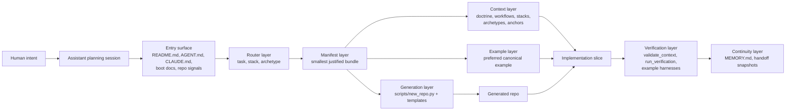
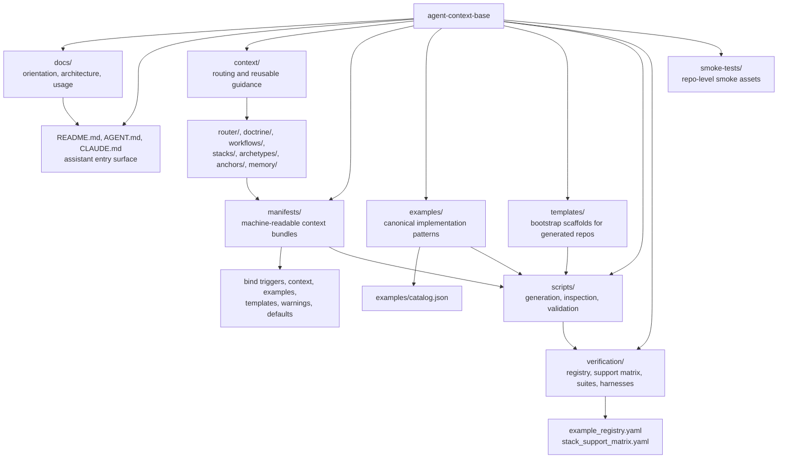
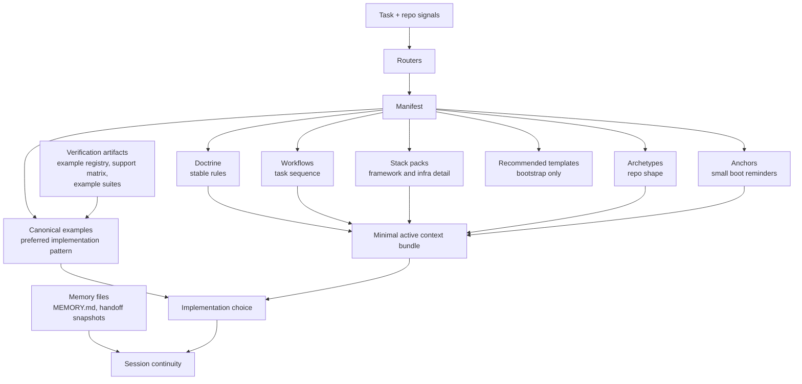
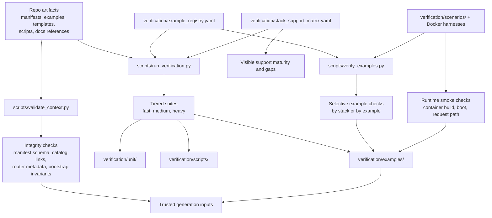
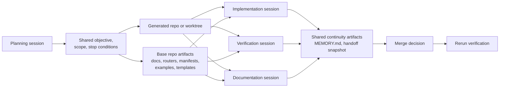

# Architecture Map

This map is the shortest path to understanding how `agent-context-base` is organized. It shows the major subsystems, the artifact flow between them, and where to go next for deeper detail. For the full runtime model, read [architecture/ASSISTANT_RUNTIME_MODEL.md](architecture/ASSISTANT_RUNTIME_MODEL.md), [architecture/CONTEXT_ENGINEERING_GUIDE.md](architecture/CONTEXT_ENGINEERING_GUIDE.md), and [usage/STARTING_NEW_PROJECTS.md](usage/STARTING_NEW_PROJECTS.md).

## System Overview

`agent-context-base` is a planning, routing, generation, and verification runtime for assistant-led software work. It turns a human request into a narrow context bundle, a preferred implementation pattern, a generated repo shape when needed, a verification path, and a continuity checkpoint.

## Repository Structure Map

The repository is split into a small set of layers with explicit responsibilities. The important distinction is that `context/`, `manifests/`, `examples/`, and `templates/` are different kinds of guidance, while `scripts/` and `verification/` operationalize them.

## New Project Generation Flow

New product repos are not assembled manually. The base repo is used to classify the idea, pick the initial repo shape, and generate the first working repo with the right scaffolding and defaults.

```mermaid
flowchart LR
    A[Vague idea] --> B[Planning session in agent-context-base]
    B --> C[Repo signal and intent synthesis]
    C --> D[Context selection<br/>routers + manifests + examples]
    D --> E[Proposed scripts/new_repo.py arguments]
    E --> F[scripts/new_repo.py]
    F --> G[Manifest defaults]
    F --> H[Templates and generated profiles]
    G --> I[Generated repository]
    H --> I
    I --> J[Fresh implementation session]
    J --> K[Incremental coding slices]
    K --> L[Repo-local verification]
    L --> M[MEMORY.md or handoff for continued work]
```

This flow is described in detail in [usage/STARTING_NEW_PROJECTS.md](usage/STARTING_NEW_PROJECTS.md).

## Context System Map

The context system is built to keep startup narrow. Routers and manifests decide what should load; they do not make all artifact types equivalent.

Context authority stays ordered: code and runnable examples first, doctrine for stable rules, manifests for bundle selection, examples for preferred patterns, templates for scaffolding, and memory files for continuity only. See [architecture/CONTEXT_ENGINEERING_GUIDE.md](architecture/CONTEXT_ENGINEERING_GUIDE.md) and [architecture/ASSISTANT_RUNTIME_MODEL.md](architecture/ASSISTANT_RUNTIME_MODEL.md).

## Verification System Map

Verification exists to keep canonical examples, manifests, scripts, and generated-repo assumptions aligned. The system does not rely on prose trust alone.

Together these checks ensure that the examples assistants copy from are still valid, that manifests point to real files, and that stack support claims stay explicit. See [../verification/README.md](../verification/README.md) and [architecture/ASSISTANT_RUNTIME_MODEL.md](architecture/ASSISTANT_RUNTIME_MODEL.md).

## Multi-Agent Workflow Map

The repository supports multi-assistant work through explicit artifact boundaries, not hidden orchestration. Each session should own one concern and coordinate through shared repository artifacts.

The practical rule is boundary ownership: one assistant plans, one implements a slice, one proves the verification path, and one updates the supporting docs only when needed. See [usage/ADVANCED_ASSISTANT_OPERATIONS.md](usage/ADVANCED_ASSISTANT_OPERATIONS.md) and [memory-layer-overview.md](memory-layer-overview.md).

## System Component Index

| Component | Primary location | Role | Deeper documentation |
| --- | --- | --- | --- |
| Entry surface | `README.md`, `AGENT.md`, `CLAUDE.md`, `docs/context-boot-sequence.md` | Defines how humans and assistants start, what to read first, and how to avoid broad scanning. | [context-boot-sequence.md](context-boot-sequence.md), [session-start.md](session-start.md) |
| Router layer | `context/router/` | Maps task language and repo signals onto workflows, stacks, and archetypes. | [architecture/ASSISTANT_RUNTIME_MODEL.md](architecture/ASSISTANT_RUNTIME_MODEL.md), [repo-layout.md](repo-layout.md) |
| Context layer | `context/doctrine/`, `context/workflows/`, `context/stacks/`, `context/archetypes/`, `context/anchors/` | Holds reusable guidance with explicit authority boundaries. | [architecture/CONTEXT_ENGINEERING_GUIDE.md](architecture/CONTEXT_ENGINEERING_GUIDE.md), [repo-purpose.md](repo-purpose.md) |
| Manifest layer | `manifests/` | Binds triggers, required context, optional context, preferred examples, recommended templates, warnings, and bootstrap defaults. | [architecture/ASSISTANT_RUNTIME_MODEL.md](architecture/ASSISTANT_RUNTIME_MODEL.md), [../scripts/README.md](../scripts/README.md) |
| Canonical example library | `examples/`, `examples/catalog.json` | Provides preferred completed patterns for implementation, testing, prompts, storage, and operations. | [../examples/README.md](../examples/README.md), [../verification/README.md](../verification/README.md) |
| Generation system | `scripts/new_repo.py`, `templates/` | Generates descendant repos, generated profiles, Compose defaults, and optional starter assets. | [usage/STARTING_NEW_PROJECTS.md](usage/STARTING_NEW_PROJECTS.md), [../scripts/README.md](../scripts/README.md) |
| Verification harness | `verification/`, `scripts/validate_context.py`, `scripts/run_verification.py`, `scripts/verify_examples.py` | Validates repo integrity, example trust, support coverage, and runnable boundaries. | [../verification/README.md](../verification/README.md) |
| Continuity and memory | `context/memory/`, `templates/memory/`, `scripts/init_memory.py`, `scripts/create_handoff_snapshot.py` | Preserves current working state across long sessions and assistant handoffs. | [memory-layer-overview.md](memory-layer-overview.md), [usage/ADVANCED_ASSISTANT_OPERATIONS.md](usage/ADVANCED_ASSISTANT_OPERATIONS.md) |
| Inspection and classification tools | `scripts/preview_context_bundle.py`, `scripts/prompt_first_repo_analyzer.py`, `scripts/pattern_diff.py` | Helps assistants and operators inspect bundle selection, classify repo shape, and compare patterns. | [../scripts/README.md](../scripts/README.md) |
| Documentation system | `docs/` | Provides orientation, architecture, operating rules, and usage guidance without replacing code or verification. | [repo-layout.md](repo-layout.md), [repo-purpose.md](repo-purpose.md) |

## Documentation Map

| Document | Purpose | Recommended reading order |
| --- | --- | --- |
| [../README.md](../README.md) | Front-door overview of what the repo is and how it is normally used. | 1 |
| [context-boot-sequence.md](context-boot-sequence.md) | Deterministic startup sequence for assistants. | 2 |
| [repo-purpose.md](repo-purpose.md) | Defines the repo's mission, limits, supported shapes, and core terminology. | 3 |
| [repo-layout.md](repo-layout.md) | Maps the top-level artifact layers and practical extension rules. | 4 |
| [session-start.md](session-start.md) | Fast operator checklist for beginning or resuming work. | 5 |
| [architecture/ASSISTANT_RUNTIME_MODEL.md](architecture/ASSISTANT_RUNTIME_MODEL.md) | Normative high-level runtime model across routing, manifests, examples, verification, and continuity. | 6 |
| [architecture/CONTEXT_ENGINEERING_GUIDE.md](architecture/CONTEXT_ENGINEERING_GUIDE.md) | Explains how context is kept narrow and why artifact boundaries matter. | 7 |
| [architecture-mental-model.md](architecture-mental-model.md) | Small companion diagram set for runtime, generation, verification, and multi-agent flow. | 8 |
| [usage/STARTING_NEW_PROJECTS.md](usage/STARTING_NEW_PROJECTS.md) | Operator workflow for turning an idea into a generated repo, including 100 example initial prompts. | 9 |
| [usage/ASSISTANT_BEHAVIOR_SPEC.md](usage/ASSISTANT_BEHAVIOR_SPEC.md) | Normative assistant behavior contract for this system and derived repos. | 10 |
| [usage/ADVANCED_ASSISTANT_OPERATIONS.md](usage/ADVANCED_ASSISTANT_OPERATIONS.md) | Long-running session guidance, multi-agent coordination, and cross-repo boundaries. | 11 |
| [memory-layer-overview.md](memory-layer-overview.md) | Explains the role of `MEMORY.md` and handoff snapshots. | 12 |
| [../verification/README.md](../verification/README.md) | Explains the verification framework, example trust model, and maturity ladder. | 13 |
| [system-operating-manual.md](system-operating-manual.md) | One-page operational reference: the end-to-end flow and working rules. | reference |
| [system-self-explanation.md](system-self-explanation.md) | Concise explanation of each layer's single responsibility. | reference |
| [CONTRIBUTOR_PLAYBOOK.md](CONTRIBUTOR_PLAYBOOK.md) | Rules and checklists for extending the repo: stacks, examples, archetypes, verification. | reference |
| [context-evolution.md](context-evolution.md) | Reverse-chronological changelog of architectural changes to the base. | reference |
| [assistant-failure-modes.md](assistant-failure-modes.md) | Catalog of common assistant failure patterns and their primary mitigations. | reference |
| [deployment-readiness-checklists.md](deployment-readiness-checklists.md) | Baseline checks before treating a deployment boundary as real. | reference |
| [public-example-backend-driven-ui-readiness.md](public-example-backend-driven-ui-readiness.md) | Readiness summary for future public repos needing backend-driven UI capability. | reference |
| [public-example-data-systems-readiness.md](public-example-data-systems-readiness.md) | Readiness summary for future public repos with non-trivial data acquisition and storage. | reference |
| [public-example-documentation-timing-readiness.md](public-example-documentation-timing-readiness.md) | Governance for delaying front-facing docs in derived repos until implementation is real. | reference |

## Design Principles Summary

- Context discipline: route first, then load the smallest justified bundle instead of scanning broadly.
- Clear artifact authority: doctrine, workflows, stacks, archetypes, manifests, examples, templates, and memory files each have one job.
- Verification-first development: examples are trusted only when the registry, harnesses, and verification tiers keep them current.
- Bounded assistant autonomy: assistants move quickly only when workflow, stack, repo shape, and verification path are clear.
- Lightweight generated repos: the base repo handles planning and bootstrap; the product repo should stay focused on product code.
- Incremental architecture evolution: new stacks and patterns are promoted by extending routers, manifests, examples, and verification together.
