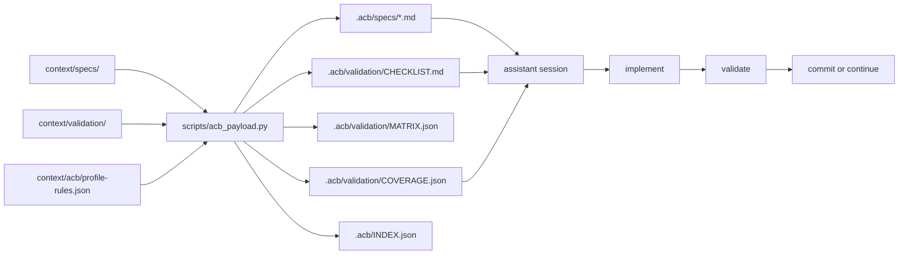
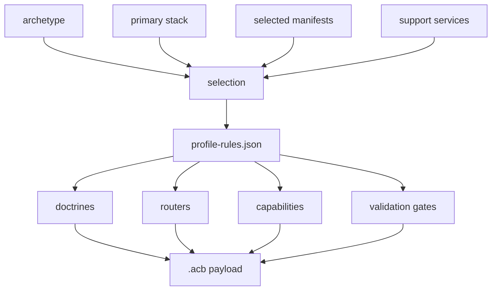
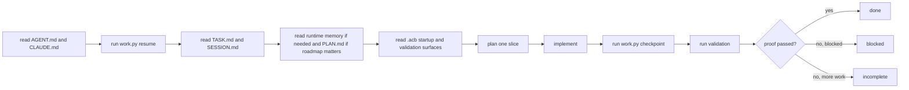
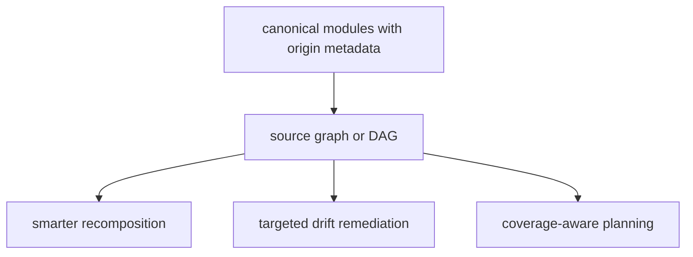

# Architecture Map

This is the shortest accurate map of how `agent-context-base` currently works.

## System Shape

- canonical context and validation source files live under `context/`
- manifests and composition rules decide what should be loaded or generated
- `scripts/work.py` manages repo-local runtime state and checkpoint heuristics
- `scripts/new_repo.py` generates descendant repos
- `scripts/acb_payload.py` composes the repo-local `.acb/` payload
- verification keeps examples, scripts, docs, and generation assumptions aligned

## Spec + Validation Flow

## `.acb` Composition Flow

## Session Execution Loop

## Context Validation Layer

Three executable tools for context visibility and validation:

| Tool | Command | What it does |
| --- | --- | --- |
| Budget model | `work.py budget-report --bundle <files>` | Scores a declared bundle against the cost model in `context-complexity-budget.md`. |
| Startup trace | `work.py startup-trace write` | Records what the assistant declares it loaded; this is self-reported, not verified. |
| Route check | `work.py route-check "<prompt>"` | Heuristic capability inference from prompt text; output is always labeled heuristic. |

These tools are optional. Derived repos enable them via `startup_features` in
`.acb/profile/selection.json`.

## Terminal Tooling Capability Area

Terminal tooling is a first-class capability area covering CLI tools, TUI
applications, and dual-mode (CLI+TUI) operator consoles.

### Doctrine
`context/doctrine/terminal-ux-first-class.md` - 11 rules governing terminal examples

### Archetypes
| Archetype | When |
| --- | --- |
| `cli-tool` | Simple command-line utilities |
| `terminal-tui` | Full-screen TUI applications |
| `terminal-dual-mode` | CLI + TUI sharing a domain core |

### Stacks
14 terminal stacks in `context/stacks/terminal-*.yaml` covering Python, Rust,
Go, TypeScript, Java, Ruby, and Elixir. See `context/router/stack-router.md`
-> Terminal Stacks section.

### Canonical Examples
`examples/canonical-terminal/` contains 14 examples across 7 languages. All
implement the TaskFlow Monitor domain. See `CATALOG.md` and
`DECISION_GUIDE.md`.

### Validation
`docs/terminal-validation-contract.md` and
`verification/scenarios/terminal-smoke-baseline.md`

Skills: `context/skills/terminal-example-selection.md`,
`context/skills/terminal-validation-path-selection.md`

## Schema Validation and Contract Generation Arc (PROMPT_113–118)

- Doctrine: `context/doctrine/schema-validation-contracts.md` (8 rules, 3 lanes)
- Archetype: `context/archetypes/polyglot-validation-lab.md`
- Stacks: `context/stacks/schema-validation-{python,typescript,go,rust,kotlin,ruby,elixir}.yaml`
- Skills: `context/skills/schema-validation-lane-selection.md`,
  `context/skills/contract-generation-path-selection.md`
- Manifest: `manifests/schema-validation-polyglot.yaml`
- Workflow: `context/workflows/add-schema-validation-example.md`
- Examples: `examples/canonical-schema-validation/` (18 examples, 7 languages, 3 lanes)
- Corpus: `examples/canonical-schema-validation/domain/` (5 models, 23 fixtures)
- Docs: `docs/schema-validation-arc-overview.md`,
  `docs/schema-validation-drift-detection.md`
- Tests: `verification/schema-validation/` (fixture tests, parity runner)
- Status: COMPLETE (PROMPT_118)

## Future Direction

Clearly future-facing, not implemented yet:

## Directory Index

| Path | Current role |
| --- | --- |
| [`context/specs/`](../context/specs/README.md) | Canonical product, architecture, agent, and evolution modules. |
| [`context/validation/`](../context/validation/README.md) | Canonical validation narratives. |
| [`context/acb/`](../context/acb/README.md) | Machine-readable profile composition rules. |
| [`manifests/`](../manifests) | Bundle selection for routing and generation. |
| [`scripts/`](../scripts/README.md) | Runtime continuity, generation, composition, inspection, and verification entrypoints. |
| [`verification/`](../verification/README.md) | Repository and example verification. |

## Recommended Follow-On Reads

1. [`docs/usage/SPEC_DRIVEN_ACB_PAYLOADS.md`](usage/SPEC_DRIVEN_ACB_PAYLOADS.md)
2. [`docs/runtime-state-workflow.md`](runtime-state-workflow.md)
3. [`docs/usage/ASSISTANT_BEHAVIOR_SPEC.md`](usage/ASSISTANT_BEHAVIOR_SPEC.md)
4. [`scripts/README.md`](../scripts/README.md)
