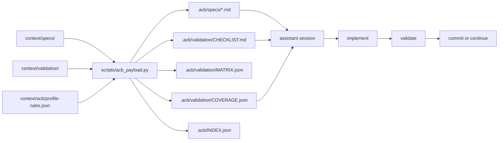
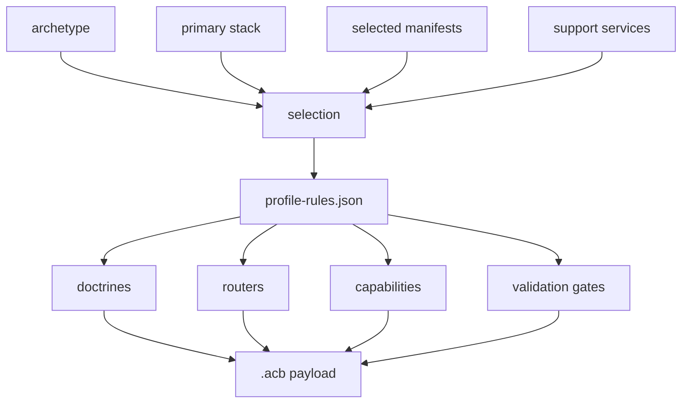
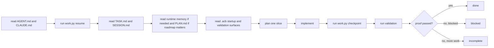
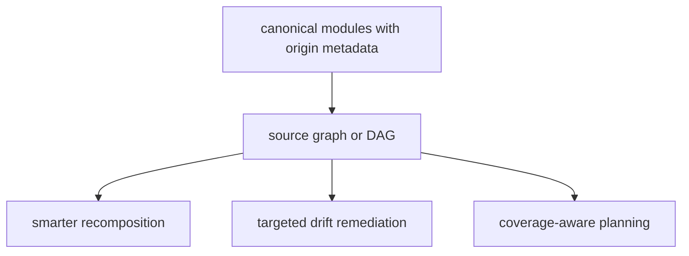

# Architecture Map

This is the shortest accurate map of how `agent-context-base` currently works.

## System Shape

- canonical context and validation source files live under `context/`
- manifests and composition rules decide what should be loaded or generated
- `scripts/work.py` manages repo-local runtime state and checkpoint heuristics
- `scripts/new_repo.py` generates descendant repos
- `scripts/acb_payload.py` composes the repo-local `.acb/` payload
- verification keeps examples, scripts, docs, and generation assumptions aligned

## Spec + Validation Flow

## `.acb` Composition Flow

## Session Execution Loop

## Context Validation Layer

Three executable tools for context visibility and validation:

| Tool | Command | What it does |
| --- | --- | --- |
| Budget model | `work.py budget-report --bundle <files>` | Scores a declared bundle against the cost model in `context-complexity-budget.md`. |
| Startup trace | `work.py startup-trace write` | Records what the assistant declares it loaded; this is self-reported, not verified. |
| Route check | `work.py route-check "<prompt>"` | Heuristic capability inference from prompt text; output is always labeled heuristic. |

These tools are optional. Derived repos enable them via `startup_features` in
`.acb/profile/selection.json`.

## Terminal Tooling Capability Area

Terminal tooling is a first-class capability area covering CLI tools, TUI
applications, and dual-mode (CLI+TUI) operator consoles.

### Doctrine
`context/doctrine/terminal-ux-first-class.md` - 11 rules governing terminal examples

### Archetypes
| Archetype | When |
| --- | --- |
| `cli-tool` | Simple command-line utilities |
| `terminal-tui` | Full-screen TUI applications |
| `terminal-dual-mode` | CLI + TUI sharing a domain core |

### Stacks
14 terminal stacks in `context/stacks/terminal-*.yaml` covering Python, Rust,
Go, TypeScript, Java, Ruby, and Elixir. See `context/router/stack-router.md`
-> Terminal Stacks section.

### Canonical Examples
`examples/canonical-terminal/` contains 14 examples across 7 languages. All
implement the TaskFlow Monitor domain. See `CATALOG.md` and
`DECISION_GUIDE.md`.

### Validation
`docs/terminal-validation-contract.md` and
`verification/scenarios/terminal-smoke-baseline.md`

Skills: `context/skills/terminal-example-selection.md`,
`context/skills/terminal-validation-path-selection.md`

## Schema Validation and Contract Generation Arc (PROMPT_113–118)

- Doctrine: `context/doctrine/schema-validation-contracts.md` (8 rules, 3 lanes)
- Archetype: `context/archetypes/polyglot-validation-lab.md`
- Stacks: `context/stacks/schema-validation-{python,typescript,go,rust,kotlin,ruby,elixir}.yaml`
- Skills: `context/skills/schema-validation-lane-selection.md`,
  `context/skills/contract-generation-path-selection.md`
- Manifest: `manifests/schema-validation-polyglot.yaml`
- Workflow: `context/workflows/add-schema-validation-example.md`
- Examples: `examples/canonical-schema-validation/` (18 examples, 7 languages, 3 lanes)
- Corpus: `examples/canonical-schema-validation/domain/` (5 models, 23 fixtures)
- Docs: `docs/schema-validation-arc-overview.md`,
  `docs/schema-validation-drift-detection.md`
- Tests: `verification/schema-validation/` (fixture tests, parity runner)
- Status: COMPLETE (PROMPT_118)

## Faker and Synthetic Data Generation Arc (PROMPT_119–126)

- Doctrine:   `context/doctrine/synthetic-data-realism.md` (7 rules)
- Archetype:  `context/archetypes/synthetic-data-generator.md`
- Stacks:     `context/stacks/faker-{python,javascript,go,rust,java,kotlin,scala,ruby,php,elixir}.yaml` (10 stacks)
- Skills:     `context/skills/faker-library-selection.md`, `context/skills/synthetic-dataset-design.md`
- Workflow:   `context/workflows/add-faker-example.md`
- Manifest:   `manifests/faker-polyglot.yaml`
- Domain:     `examples/canonical-faker/domain/` (TenantCore, 7 entities, 4 profiles)
- Examples:   `examples/canonical-faker/` (10 examples, 10 languages)
- Validator:  `examples/canonical-faker/domain/validate_output.py`
- Docs:       `docs/faker-arc-overview.md`
- Tests:      `verification/faker/` (per-language + parity runner)
- Status:     COMPLETE (PROMPT_126)

## Plotly + HTMX + Tailwind Analytics Arc

Status: COMPLETE (PROMPT_127–133)

- doctrine: plotly-htmx-server-rendered-viz.md, tailwind-utility-first.md
- archetype: analytics-workbench
- stacks: 4 (Python/FastAPI/Jinja2, Go/Echo/templ, Rust/Axum/Askama, Elixir/Phoenix/HEEx)
- skills: chart-type-selection, plotly-figure-builder-design
- workflow: add-visualization-panel
- canonical examples: python/, go/, rust/, elixir/ — all 6 chart families
- domain: Ops & Product Analytics Workbench (dogfooding canonical-faker)
- overview: docs/plotly-htmx-arc-overview.md

## JWT Auth, RBAC, and Multi-Tenant Backend Patterns Arc

Status: HARDENED AND VERIFIED (PROMPT_134-140)

- doctrines: jwt-auth-request-context.md, rbac-permission-taxonomy.md,
  tenant-boundary-enforcement.md, route-metadata-registry.md,
  me-endpoint-discoverability.md
- archetype: tenant-aware-backend-api
- stacks: 8 JWT auth backend stacks across Python, TypeScript, Go, Rust, Java,
  Kotlin, Ruby, and Elixir
- skills: jwt-middleware-implementation, permission-catalog-design,
  me-endpoint-design, route-metadata-annotation
- workflows: add-protected-endpoint, add-tenant-aware-canonical-example
- manifest: manifests/auth-jwt-rbac-polyglot.yaml
- canonical examples: python, typescript, go, rust, java, kotlin, ruby, elixir
- domain: TenantCore IAM (dogfoods the canonical-faker TenantCore surface)
- overview: docs/jwt-auth-arc-overview.md
- verification: docs/jwt-auth-arc-overview.md (`Verification Status`) and
  `verification/auth/run_parity_check.py` confirm the full eight-language arc
  is green

## Future Direction

Clearly future-facing, not implemented yet:

## Directory Index

| Path | Current role |
| --- | --- |
| [`context/specs/`](../context/specs/README.md) | Canonical product, architecture, agent, and evolution modules. |
| [`context/validation/`](../context/validation/README.md) | Canonical validation narratives. |
| [`context/acb/`](../context/acb/README.md) | Machine-readable profile composition rules. |
| [`manifests/`](../manifests) | Bundle selection for routing and generation. |
| [`scripts/`](../scripts/README.md) | Runtime continuity, generation, composition, inspection, and verification entrypoints. |
| [`verification/`](../verification/README.md) | Repository and example verification. |

## Recommended Follow-On Reads

1. [`docs/usage/SPEC_DRIVEN_ACB_PAYLOADS.md`](usage/SPEC_DRIVEN_ACB_PAYLOADS.md)
2. [`docs/runtime-state-workflow.md`](runtime-state-workflow.md)
3. [`docs/usage/ASSISTANT_BEHAVIOR_SPEC.md`](usage/ASSISTANT_BEHAVIOR_SPEC.md)
4. [`docs/usage/ADVANCED_ASSISTANT_OPERATIONS.md`](usage/ADVANCED_ASSISTANT_OPERATIONS.md)
5. [`scripts/README.md`](../scripts/README.md)
