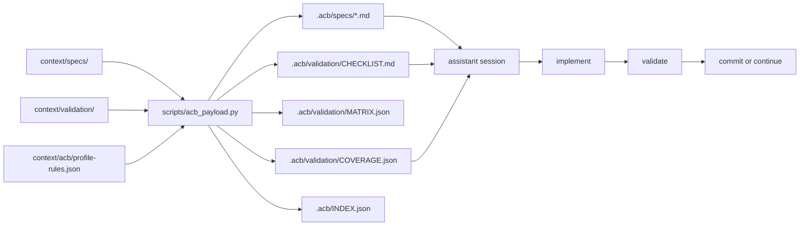
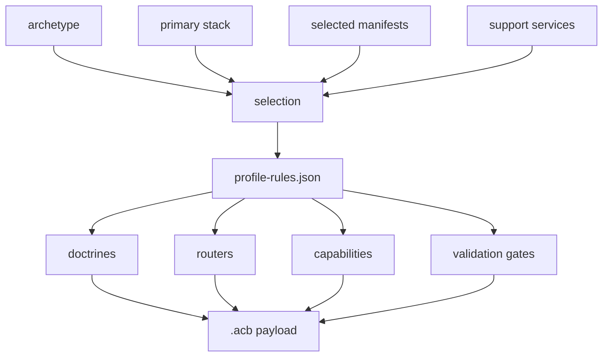
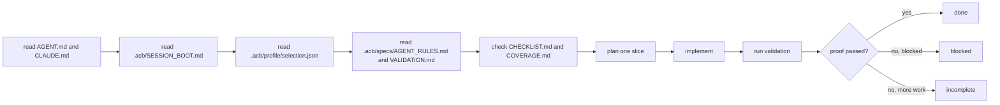
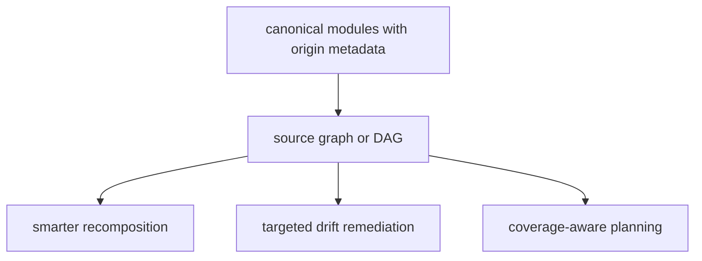

# Architecture Map

This is the shortest accurate map of how `agent-context-base` currently works.

## System Shape

- canonical context and validation source files live under `context/`
- manifests and composition rules decide what should be loaded or generated
- `scripts/new_repo.py` generates descendant repos
- `scripts/acb_payload.py` composes the repo-local `.acb/` payload
- verification keeps examples, scripts, docs, and generation assumptions aligned

## Spec + Validation Flow

## `.acb` Composition Flow

## Session Execution Loop

## Future Direction

Clearly future-facing, not implemented yet:

## Directory Index

| Path | Current role |
| --- | --- |
| [`context/specs/`](../context/specs/README.md) | Canonical product, architecture, agent, and evolution modules. |
| [`context/validation/`](../context/validation/README.md) | Canonical validation narratives. |
| [`context/acb/`](../context/acb/README.md) | Machine-readable profile composition rules. |
| [`manifests/`](../manifests) | Bundle selection for routing and generation. |
| [`scripts/`](../scripts/README.md) | Generation, composition, inspection, and verification entrypoints. |
| [`verification/`](../verification/README.md) | Repository and example verification. |

## Recommended Follow-On Reads

1. [`docs/usage/SPEC_DRIVEN_ACB_PAYLOADS.md`](usage/SPEC_DRIVEN_ACB_PAYLOADS.md)
2. [`docs/usage/ASSISTANT_BEHAVIOR_SPEC.md`](usage/ASSISTANT_BEHAVIOR_SPEC.md)
3. [`scripts/README.md`](../scripts/README.md)
