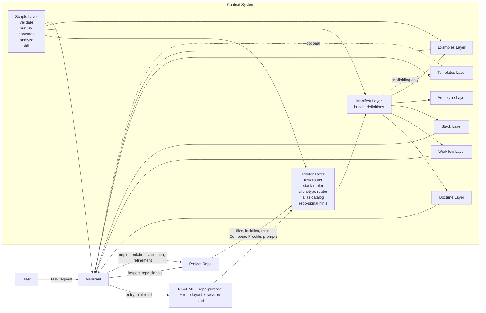
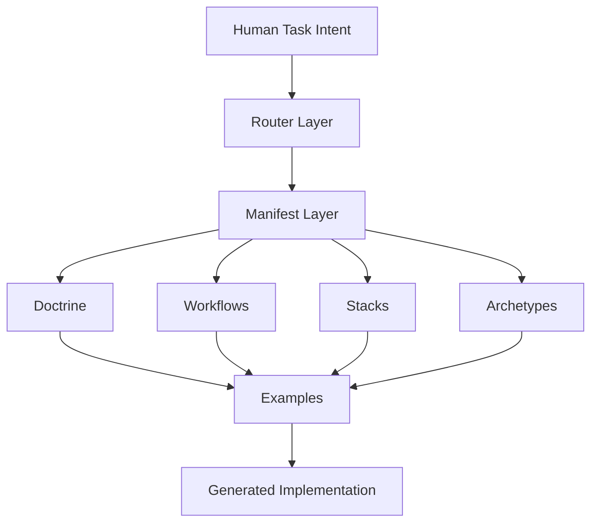
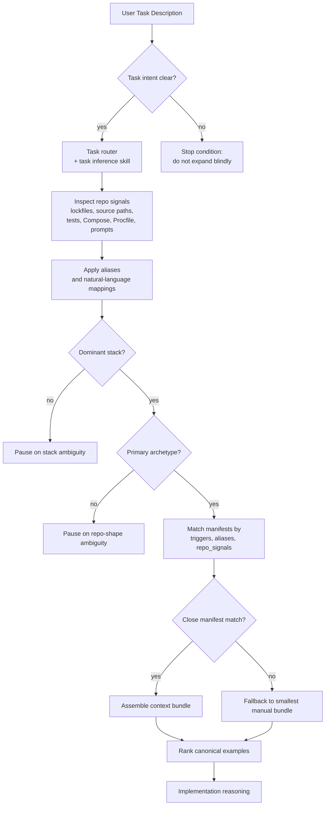
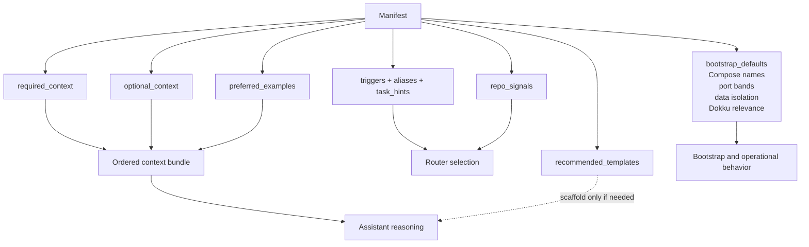
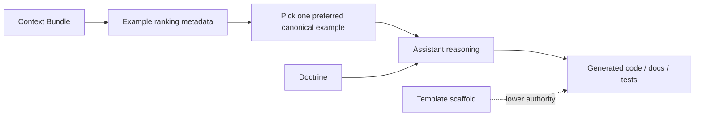
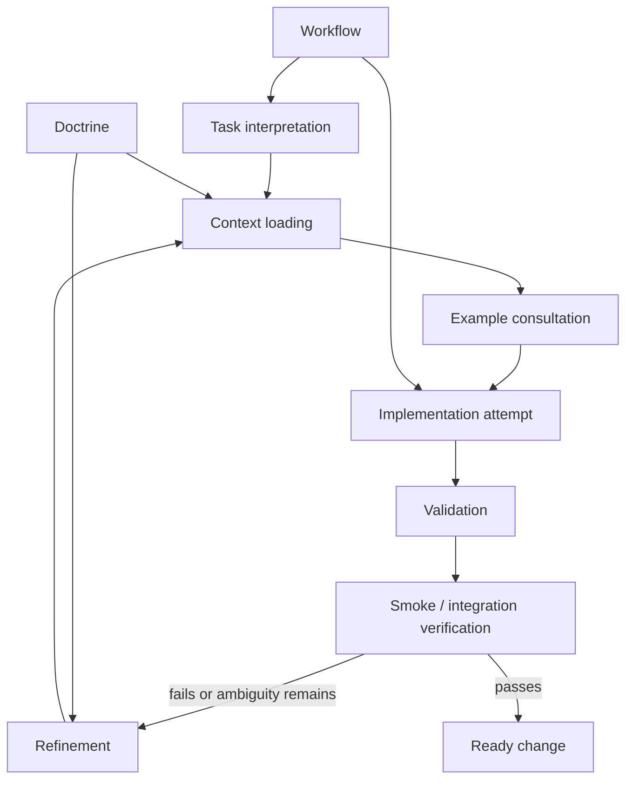
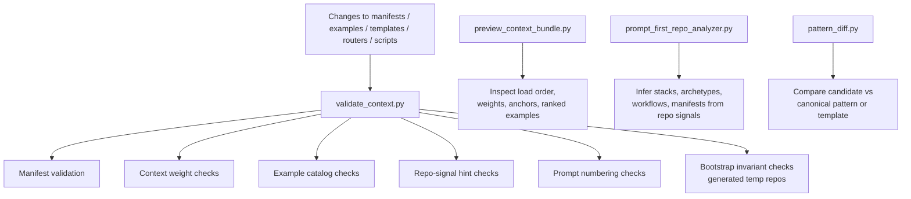
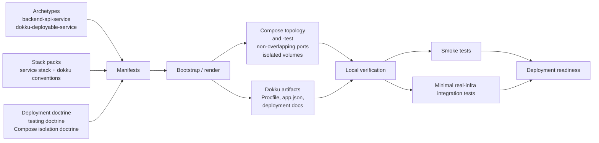
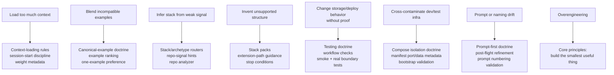
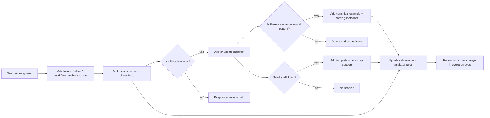

# Agent Context Base Architecture Mental Model

The current repository behaves like a context operating system for future repos, not like an application. Its own analyzer resolves it as a `prompt-first-repo` with the `prompt-first-meta-repo` manifest, and the full integrity check currently passes across 14 manifests. The architecture is therefore best understood as a deterministic narrowing pipeline: infer intent, detect repo shape, assemble the smallest valid bundle, implement, then validate.

## SECTION 1 - System Overview Diagram

This is the real control shape of the repo. The assistant does not start from "scan everything"; it starts from a small entrypoint, uses routers to infer the active task and repo shape, lets manifests assemble a bounded context set, then uses examples to shape implementation. The "Project Repo" is usually a descendant repo, but for meta-work inside this repository it can be this repo itself.

## SECTION 2 - Context Layer Stack Diagram

Information flows downward by increasing specificity. Human intent is ambiguous; routers turn it into a probable task, stack, and archetype; manifests convert that inference into explicit file lists; doctrine constrains behavior; workflows sequence work; stacks and archetypes localize technical detail; examples finally shape the output surface.

Stable layers are doctrine, routers, example metadata, weights, templates, and the pack documents themselves. Task-specific choices are the selected workflow, selected archetype, active stack set, chosen manifest, and chosen canonical example.

## SECTION 3 - Router Inference Flow Diagram

This is exactly what the repository encodes in the task router, stack router, archetype router, alias catalog, repo-signal hints, and stop-condition doctrine. The prompt analyzer operationalizes the repo-signal step, while the alias catalog makes normal language usable without requiring users to know internal filenames.

The key design choice is that ambiguity stops expansion rather than triggering more loading. That is how the repo prevents "I'm not sure, so I'll read everything."

## SECTION 4 - Manifest-Driven Context Assembly Diagram

Manifests are the repo's context glue because they bind inference to concrete files. They do three jobs at once: help routers decide whether a manifest fits, declare the exact context to load, and carry operational defaults such as Compose naming, port bands, data isolation, smoke expectations, and Dokku support.

The actual bundle order is deterministic: repository entrypoints first, then the manifest itself, then required context, then optional context, then preferred examples. Metadata is distributed but coherent: alias metadata lives in the alias catalog, example metadata in the example catalog, context weighting in the weights file, and manifest schema rules in code rather than in a separate schema file.

## SECTION 5 - Canonical Example Influence Diagram

Examples exist late in the pipeline on purpose. They are not discovery tools; they are implementation-shaping tools once the task, stack, and archetype are already narrow.

This prevents hallucinated architecture in three ways. First, ranking is explicit rather than memory-based. Second, one preferred example is favored over blended hybrids. Third, templates stay lower-authority than canonical examples, so scaffolds do not become accidental architecture.

## SECTION 6 - Assistant Execution Loop Diagram

Doctrine and workflows play different roles in the loop. Doctrine says what must remain true: minimal context, canonical-example priority, test realism, Compose isolation, prompt monotonicity, stop conditions. Workflows say what order to do work in: identify surface, implement happy path, add smoke coverage, add real boundary verification if needed, refine.

This makes the loop conservative without making it static. The assistant can iterate, but every iteration is still routed and constrained.

## SECTION 7 - Context Integrity and Validation Diagram

This layer is why the system stays healthy over time instead of decaying into inconsistent docs. Validation does not just lint syntax; it checks that manifests point to real files, that example metadata covers the real example set, that prompt numbering stays monotonic, and that bootstrapped repos preserve Compose names, isolated ports, distinct env files, and separate dev/test volume roots.

A subtle but important detail is that the manifest schema is enforced in code. That keeps the schema executable, not merely documented.

## SECTION 8 - Deployment and Operational Layer Diagram

Deployment is not a separate universe in this architecture. It is an extension of the same routing model: archetype says "single deployable service," stack says "what boots," doctrine says "what must be explicit," manifests carry the operational defaults, and smoke plus integration tests prove the service locally before Dokku wiring is trusted.

The philosophy is intentionally narrow: simple deployable services, explicit release surfaces, and local isolation first. This repo is not trying to grow into a platform orchestration framework.

## SECTION 9 - Failure Modes Diagram

This is the repository's real anti-hallucination model. It does not assume assistants will "be careful"; it builds explicit structural countermeasures against the common ways assistants go wrong.

The most important defense is not any single rule. It is the combination of bounded loading, manifest assembly, ranked canonical examples, and hard stop conditions when ambiguity persists.

## SECTION 10 - Evolution Diagram

The growth model is staged and deliberately asymmetric. New stacks can begin as extension paths; they do not become manifest-backed, example-backed, or template-backed until the pattern is recurring and stable.

That is what allows safe growth. The repo can expand its coverage without turning every idea into first-class architecture.

## SECTION 11 - Visual Mental Model Summary

"Routers infer intent, manifests assemble context, doctrine constrains behavior, workflows sequence execution, stacks and archetypes localize detail, and canonical examples keep implementation from drifting."

In practice, this means the repository behaves less like documentation and more like a deterministic control plane for assistant reasoning. The assistant reads a small entrypoint, infers the task and repo shape, loads one bounded bundle, uses one canonical example to shape output, validates the result, and stops when ambiguity would otherwise force invention.
