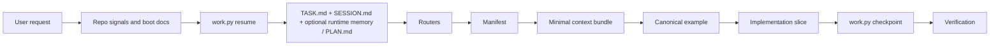
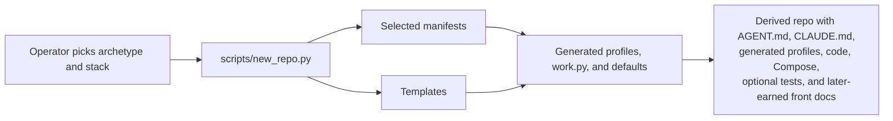
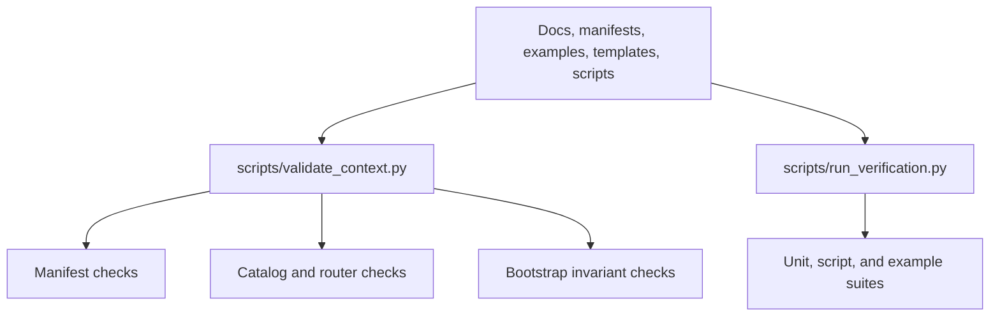
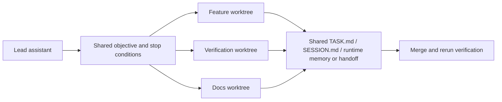

# Architecture Mental Model

This document is the visual companion to `docs/architecture/ASSISTANT_RUNTIME_MODEL.md`.

## Assistant Runtime

The assistant does not jump from request to code. Runtime-state rehydration, routing, and manifest selection happen first.

## Repo Generation

This matches the code in `scripts/new_repo.py`: manifests supply defaults and operational metadata, while templates supply the initial file content. Front-facing README and docs content are now intentionally deferred by default.

## Verification Loop

The repo stays healthy because it validates both metadata integrity and runnable example behavior.

## Multi-Agent Coordination

This is a coordination pattern, not built-in automation. Each assistant owns one slice, then the shared continuity artifact records what can be merged next.
