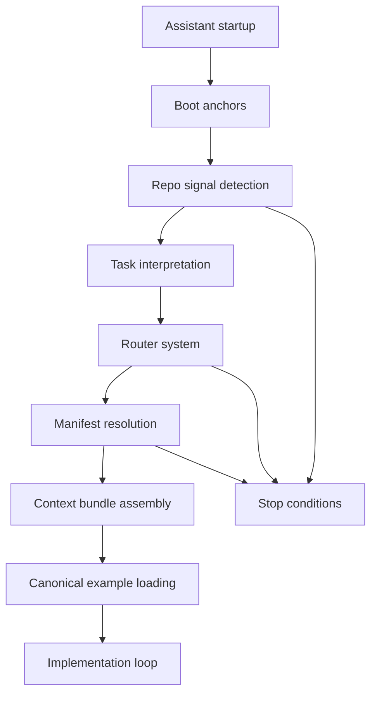

# Context Boot Sequence

The Context Boot Sequence is the deterministic startup contract for assistants operating inside a repo derived from `agent-context-base`.

Its job is simple: make assistant startup behave like runtime initialization instead of ad hoc exploration.

## Section 1 - Boot Sequence Philosophy

Assistants need a boot sequence for the same reason operating systems need process initialization: a stable startup path creates predictable behavior.

Without a boot sequence, assistants tend to load context opportunistically. That causes four recurring failures:

- hallucinated architecture because the assistant infers repo structure from a partial or noisy sample
- mixed patterns because examples, templates, and stack conventions get blended without a dominant source of truth
- excessive scanning because the assistant keeps opening files to compensate for weak early assumptions
- inconsistent reasoning because two sessions can start from different files and reach different conclusions

A deterministic boot sequence prevents this by forcing a fixed order:

1. establish repo identity
2. infer task and repo signals
3. resolve the dominant routing path
4. load one minimal context bundle
5. consult canonical examples before implementation

The result is a predictable assistant runtime:

- smaller context windows
- fewer architectural guesses
- stronger reuse of repo-native patterns
- cleaner stop conditions when ambiguity remains

## Section 2 - Boot Sequence Mental Model

Use this model:

`Assistant enters repo`
`-> read boot anchors`
`-> detect repo signals`
`-> interpret task`
`-> infer archetype`
`-> infer stack`
`-> consult routers`
`-> select manifest`
`-> assemble context bundle`
`-> consult canonical examples`
`-> begin implementation loop`

Stage summary:

- `read boot anchors`: load small stable reminders before deeper context
- `detect repo signals`: inspect a narrow set of root files and conventional paths
- `interpret task`: map the user request to one primary workflow
- `infer archetype`: decide the repo shape
- `infer stack`: decide the implementation family on the active surface
- `consult routers`: normalize language and signals through router docs and aliases
- `select manifest`: choose the best matching bundle definition
- `assemble context bundle`: load only the required doctrine, workflow, archetype, stack, and example surface
- `consult canonical examples`: choose the dominant implementation reference before writing code
- `begin implementation loop`: plan, implement, verify, and refine within doctrine

## Section 3 - Boot Stage Overview Diagram



The diagram shows a gated startup path, not a free-form search loop. Each stage narrows the next stage. If repo signals, routing, or manifest choice remain ambiguous, the assistant should stop instead of compensating by loading more files blindly.

## Section 4 - Boot Stage Definitions

| Stage | Purpose | Inputs | Outputs | Constraints |
| --- | --- | --- | --- | --- |
| `Stage 0 - Boot anchors` | Stabilize startup with compact repo rules. | `README.md`, `docs/context-boot-sequence.md`, boot anchor files. | Shared startup assumptions. | Read only short stable files. Do not open broad context trees yet. |
| `Stage 1 - Repo identity detection` | Determine what kind of repo this is. | Root files, lockfiles, `PROMPTS.md`, Compose files, deployment artifacts. | Candidate stack, archetype, deployment posture, Docker relevance. | Prefer filename and path signals over speculative interpretation. |
| `Stage 2 - Task interpretation` | Decide what the user is asking for. | User request, touched files if known, alias catalog. | One primary workflow candidate. | Pick the dominant workflow first. Do not mix several because they sound adjacent. |
| `Stage 3 - Router consultation` | Normalize intent and repo shape. | Task candidate, stack signals, archetype signals, aliases. | Active workflow, stack, archetype. | Use router docs before improvising a new category. |
| `Stage 4 - Manifest selection` | Choose the smallest machine-readable bundle. | Router outputs, `repo_signals`, manifest triggers and aliases. | One manifest or an explicit stop. | Never merge near-match manifests casually. |
| `Stage 5 - Context bundle assembly` | Build the ordered load list. | Manifest `required_context`, filtered `optional_context`, anchors, weights. | Ordered minimal bundle. | Load only what the task can justify. |
| `Stage 6 - Canonical example prioritization` | Choose the dominant implementation pattern. | Manifest `preferred_examples`, `examples/catalog.json`, active workflow, stack, archetype. | One primary example and at most one orthogonal support example. | Do not blend incompatible examples. Do not treat templates as canonical. |
| `Stage 7 - Implementation loop initialization` | Start work with verification defined up front. | Bundle, example, doctrine, workflow, user request. | Plan, verification path, stop conditions. | Verification must match the changed boundary, including smoke or minimal real-infra tests when warranted. |

## Section 5 - Boot Anchors

Boot anchors are the first small files assistants should read before deeper routing or manifest work.

Recommended startup anchors:

- `context/anchors/repo-identity.md`
- `context/anchors/context-loading-principles.md`
- `context/anchors/anti-patterns.md`

Why anchors must stay short and stable:

- they are startup memory, not full doctrine
- they should remain safe to reread in long sessions
- they should not accumulate task-specific detail
- they should change rarely, because unstable anchors destabilize every session

Example contents:

```md
# Repo Identity Anchor

- treat this repo as a context-routing system, not a product app
- read routers, manifests, doctrine, and examples in that order of narrowing
- prefer repo signals over guesswork when inferring stack or archetype
- treat Dokku, Compose, and prompt-first artifacts as architectural signals
- stop when more than one primary stack or archetype is still plausible
```

```md
# Context Loading Principles Anchor

- load one router, one workflow, one archetype, and one primary example first
- use manifests to assemble bundles instead of hand-collecting many files
- open optional context only when the task or repo signals activate it
- use `python scripts/preview_context_bundle.py <manifest> --show-weights --show-anchors`
- do not scan `context/`, `examples/`, or `manifests/` wholesale
```

```md
# Anti-Patterns Anchor

- do not invent a new architecture when a manifest already fits
- do not mix templates with canonical examples
- do not introduce new frameworks without stack-pack support
- do not rewrite Compose names, host ports, or data roots toward defaults
- do not keep loading context after the task is already routed
```

Task-specific anchors may be added later:

- `context/anchors/compose-isolation.md` for Docker-backed infra work
- `context/anchors/prompt-first.md` for prompt-sequence work
- `context/anchors/context-integrity.md` for metadata or validation work

## Section 6 - Repo Signal Detection

Repo signal detection should be narrow and deliberate. The assistant should inspect a small set of strong signals first:

- root manifests and lockfiles
- well-known entrypoints
- prompt-first files
- deployment artifacts
- standard dev and test Compose files
- primary and test env files when local infra matters

Useful sources in this repo:

- `context/router/repo-signal-hints.json`
- `python scripts/prompt_first_repo_analyzer.py .`

Signal mapping:

| Signal | Stack Inference | Archetype Inference | Deployment Or Boundary Implication |
| --- | --- | --- | --- |
| `pyproject.toml` + `uv.lock` + `app/main.py` | `python-fastapi-uv-ruff-orjson-polars` | `backend-api-service` | likely API service with smoke and storage doctrine |
| `package.json` + `bun.lock` or `bun.lockb` + `src/routes/*.ts` | `typescript-hono-bun` | `backend-api-service` | Bun and Hono route surface should dominate |
| `Cargo.toml` + `src/main.rs` | `rust-axum-modern` | `backend-api-service` | Axum route and test split likely apply |
| `go.mod` + `cmd/server/main.go` + `.templ` | `go-echo` | `backend-api-service` | Echo plus templ boot path should stay explicit |
| `mix.exs` + `lib/*_web/router.ex` | `elixir-phoenix` | `backend-api-service` | Phoenix router and controller structure are primary |
| `PROMPTS.md` + `.prompts/*.txt` + `AGENT.md` + `CLAUDE.md` | `prompt-first-repo` | `prompt-first-repo` | prompt numbering and profile validation matter |
| `Procfile` + `app.json` + `docs/deployment.md` | `dokku-conventions` | `dokku-deployable-service` | Dokku boot and smoke verification are first-class |
| `docker-compose.yml` + `docker-compose.test.yml` + `.env` + `.env.test` | not a stack by itself; load Compose isolation doctrine | backend API, storage, or local infra shape becomes more likely | preserve repo-derived `name:`, explicit non-default ports, and dev versus test isolation |

Compose signals must trigger these assumptions when Docker-backed infra is relevant:

- keep `docker-compose.yml` and `docker-compose.test.yml` as the standard filenames
- preserve repo-derived Compose `name:` values
- keep host ports explicit and non-default
- keep dev data and test data isolated

## Section 7 - Router Consultation

Routers convert natural-language intent plus repo signals into a minimal context decision.

Router roles:

- `context/router/task-router.md`: maps user intent to the dominant workflow
- `context/router/stack-router.md`: maps framework and file signals to the active stack pack
- `context/router/archetype-router.md`: maps repo shape to the primary archetype
- `context/router/alias-catalog.yaml`: normalizes synonyms and common shorthand

Routing rule:

1. resolve the task first
2. resolve the archetype only if repo shape matters
3. resolve the stack on the touched implementation surface
4. stop if more than one dominant route remains

Examples:

- Request: "Add a health route to my Bun service"
  - workflow: `add-api-endpoint`
  - stack: `typescript-hono-bun`
  - archetype: `backend-api-service`
  - likely manifest: `backend-api-typescript-hono-bun`

- Request: "Ship this service on Dokku and make the boot path obvious"
  - workflow: `add-deployment-support`
  - stack: application stack plus `dokku-conventions`
  - archetype: `dokku-deployable-service`
  - likely manifest: one of the `dokku-deployable-*` manifests

- Request: "Bootstrap a prompt-driven starter repo"
  - workflow: `bootstrap-repo`
  - stack: `prompt-first-repo`
  - archetype: `prompt-first-repo`
  - likely manifest: `prompt-first-meta-repo`

Routers should reduce ambiguity, not expand it. If routing still yields several plausible stacks or archetypes, use stop conditions instead of loading more files blindly.

## Section 8 - Manifest Resolution

Manifests define context bundles. They are the system's context glue because they connect doctrine, workflows, stacks, archetypes, examples, templates, and repo signals in one machine-readable surface.

Important fields:

- `required_context`: files that must be loaded for the manifest to make sense
- `optional_context`: files that may be loaded only when the task or repo signals require them
- `preferred_examples`: canonical examples that should dominate implementation style
- `triggers` and `aliases`: natural-language hints that help route requests toward the manifest
- `repo_signals`: file and path patterns that make the manifest plausible in the current repo
- `task_hints`: workflows most likely to matter for this manifest
- `warnings`: boundary reminders that should shape verification and scope
- Compose and isolation fields such as `compose_files`, `compose_project_name_dev`, `compose_project_name_test`, `port_band_*`, and `data_isolation`

Resolution rule:

1. prefer the manifest with the strongest `repo_signals` match
2. break ties with router agreement on workflow, stack, and archetype
3. use manifest warnings and task hints to filter optional context
4. if no manifest dominates, stop and say so explicitly

Operational support:

- context lint: `python scripts/validate_context.py`
- manifest validator: `python scripts/validate_manifests.py`
- context bundle preview: `python scripts/preview_context_bundle.py <manifest> --show-weights --show-anchors`

## Section 9 - Context Bundle Assembly

The final context bundle is constructed from five layers:

1. relevant doctrine
2. relevant workflow
3. relevant stack pack
4. relevant archetype pack
5. canonical examples

Deterministic assembly order:

1. boot anchors
2. manifest `required_context`
3. task-activated `optional_context`
4. one primary canonical example
5. one support example only if it covers an orthogonal boundary such as smoke testing
6. templates only if scaffolding is part of the task

Minimal context loading means:

- load the smallest bundle that can explain the change
- do not load unrelated stacks
- do not load all optional context because it exists
- do not load templates when examples already answer the implementation question

If the manifest is already known, use:

```bash
python scripts/preview_context_bundle.py <manifest> --show-weights --show-anchors
```

That command is the preferred bundle preview instead of a manual file hunt.

## Section 10 - Canonical Example Loading

Canonical examples shape generated code more strongly than abstract advice. They control naming, structure, surface boundaries, and test shape.

Selection rules:

- prefer examples named in the active manifest's `preferred_examples`
- confirm they match the active workflow, stack, and archetype
- use `examples/catalog.json` to rank close candidates
- choose one dominant implementation example
- add one support example only when it covers a different concern such as smoke tests or observability

Why preferred examples must dominate:

- manifests already encode the strongest stack and archetype fit
- preferred examples are the shortest path to repo-native implementation
- letting lower-fit examples dominate causes pattern drift

Why incompatible examples must not be blended:

- they often assume different router, test, or deployment boundaries
- blended examples create structurally invalid code
- mixed patterns usually force downstream refactors or test churn

If no example fits, say so explicitly and implement the smallest doctrine-consistent solution. Do not promote a template to canonical status just because it is nearby.

Use `python scripts/pattern_diff.py <candidate> <canonical>` when comparing a draft against a preferred pattern.

## Section 11 - Implementation Loop

After boot completes, the assistant should operate inside a constrained implementation loop:

1. `context review`
   - restate the active workflow, stack, archetype, manifest, and example
2. `implementation planning`
   - define touched files and the minimal verification path
3. `code generation`
   - follow stack and example structure instead of inventing a new pattern
4. `verification against doctrine`
   - check naming, testing, deployment, prompt, and isolation doctrine as applicable
5. `smoke-test and minimal real-infra integration-test generation when warranted`
   - add smoke tests for the main path
   - add minimal Docker-backed real boundary tests when storage, queues, search, or deployment behavior changed materially
6. `refinement`
   - run post-flight cleanup without reopening architecture

Workflows guide this loop. They describe the task sequence. Doctrine constrains what "done" means. Examples shape the implementation form. Manifests prevent the loop from drifting into unrelated context.

When Docker-backed local infra is relevant, the loop must preserve:

- repo-derived Compose `name:` values
- non-default host ports
- dev and test topology separation
- test-data isolation

## Section 12 - Guardrails And Stop Conditions

Guardrails:

- do not introduce a new framework without a stack pack or explicit extension path
- do not load unrelated stacks just because the repo may support them eventually
- do not rewrite repo architecture when the task only needs a local change
- do not replace canonical examples with improvised patterns
- do not collapse dev and test Compose files into one topology
- do not change Compose `name:` values toward generic defaults
- do not reuse default host ports if the repo already uses explicit non-default bands
- do not point test resets or seeds at dev data
- stop when the requested task is satisfied and the verification path passes

Use `context/doctrine/stop-conditions.md` when:

- more than one primary stack remains plausible
- more than one primary archetype remains plausible
- a storage, queue, search, or deployment change has no minimal verification path
- the bundle would grow without a clear dominant manifest

## Section 13 - Boot Sequence Checklist

- Read `README.md` and `docs/context-boot-sequence.md`.
- Read the boot anchors under `context/anchors/`.
- Detect repo signals from root files and standard paths.
- Interpret the user task into one primary workflow.
- Consult task, stack, archetype, and alias routers.
- Select one manifest.
- Preview and assemble the smallest context bundle.
- Load one dominant canonical example.
- Start the implementation loop with verification defined.

## Section 14 - Failure Mode Mitigation

| Failure Mode | Boot Sequence Mitigation |
| --- | --- |
| Overloading context | Startup is stage-gated and manifest-driven instead of scan-driven. |
| Architecture hallucination | Repo identity and signal detection happen before stack-specific reasoning. |
| Example blending | Canonical example selection happens after manifest resolution and prefers one dominant example. |
| Framework drift | Stack router and manifest selection keep implementation on supported patterns. |
| Testing gaps | The implementation loop requires smoke tests and minimal real-infra tests when the boundary justifies them. |
| Compose drift | Compose doctrine is loaded when Docker signals appear, preserving names, ports, and data isolation. |
| Inconsistent reasoning across sessions | Boot anchors and ordered stages make startup repeatable. |

## Section 15 - Integration With AGENT.md And CLAUDE.md

`AGENT.md` and `CLAUDE.md` should reference the boot sequence as the startup contract, not duplicate it.

Recommended lines:

```md
Follow `docs/context-boot-sequence.md` as the deterministic startup contract for this repo.
```

```md
Before loading task-specific context, complete Stage 0 through Stage 4 of `docs/context-boot-sequence.md`.
```

Their job is to route the assistant into this document, then into the smallest relevant bundle. They should remain short and avoid re-embedding all doctrine.

## Section 16 - Final Mental Model

Boot anchors stabilize understanding.  
Repo signals identify the active shape.  
Routers infer intent.  
Manifests assemble context.  
Doctrine constrains behavior.  
Examples shape implementation.  
Verification closes the loop.
