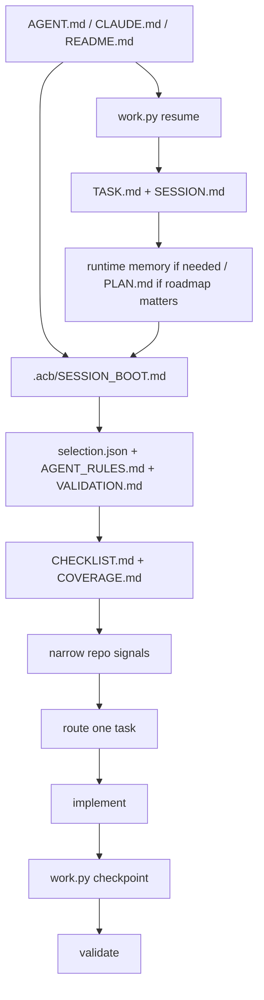

# Context Boot Sequence

This is the deterministic startup contract for assistants working in `agent-context-base` or a generated repo.

## Boot Order

1. Read stable entrypoints: `AGENT.md`, `CLAUDE.md`, and `README.md` when present.
2. Run `python3 scripts/work.py resume` when the repo has a root `scripts/` directory. In compact derived repos without a root `scripts/` directory, run `python3 .acb/scripts/work.py resume`.
3. Read `context/TASK.md` and `context/SESSION.md` when they exist. Read `context/MEMORY.md` only if durable repo-local truths matter. Read `PLAN.md` when milestone context matters. Read `tmp/*.md` only when there is an active local checklist or ad hoc session plan relevant to the task.
4. In generated repos, read `.acb/SESSION_BOOT.md`, `.acb/profile/selection.json`, `.acb/specs/AGENT_RULES.md`, and `.acb/specs/VALIDATION.md`.
5. Read `.acb/validation/CHECKLIST.md` and `.acb/validation/COVERAGE.md` when `.acb/` exists.
6. Inspect narrow repo signals: lockfiles, root manifests, source entrypoints, Compose files, prompt files, deployment artifacts.
7. Route the task and load only the active workflow, stack surface, archetype, and canonical example.
8. After completing the boot sequence, optionally run `python3 scripts/work.py startup-trace write --session "<task>" --files <files-read>` to record a self-declared startup trace for this session.

## Session Context Briefing

`work.py resume` now starts with a Session Context Briefing before the older
resume details. It is the startup overview for the current repo state, not a
record of everything the assistant must load.

- Repo state shows the current branch, HEAD anchor, and working-tree breadth.
- Runtime state shows which runtime markdown files exist and how large they are.
- Memory base shows whether `memory/INDEX.md` exists, how many summary files are
  present, and whether a recent prompt summary matches the latest git prompt
  prefix.
- Complexity budget totals the runtime-file line count and classifies the
  posture as lean, moderate, or heavy.
- Local planning state shows whether `tmp/*.md` has an active checklist and
  whether `PLAN.md` is present for roadmap use.
- Recommended next action gives one grounded next step based on the visible
  state, such as loading a relevant summary or pruning runtime notes first.

Use the briefing to decide what to load next. If the complexity budget is
heavy, prune before broad reading. If a relevant summary exists, load it before
task-specific context. The briefing is informational: it narrows startup
choices, but the assistant still decides what additional context is needed.

The startup trace is optional. Use it when the session is medium or larger,
when the task spans multiple stacks or workflows, or when you need a debugging
record of declared context loading.

## Rules

- Do not start by scanning whole directories.
- Re-read `.acb/` at the beginning of every new session.
- Use repo-local runtime markdown files for continuation state, not doctrine.
- Let `work.py resume` drive triage with its commit anchor, recent-change clues, next-step signal, and plan-review signal before broad reads.
- Keep `context/SESSION.md` concise and action-oriented.
- Update `PLAN.md` only when phases or milestones changed materially.
- Use `tmp/*.md` for session-scoped checklists or scratch plans, not for roadmap state.
- Prefer one active boundary and one validation path.
- Treat validation as required before claiming completion.
- Use `blocked`, `incomplete`, and `done` precisely.

## Diagram

