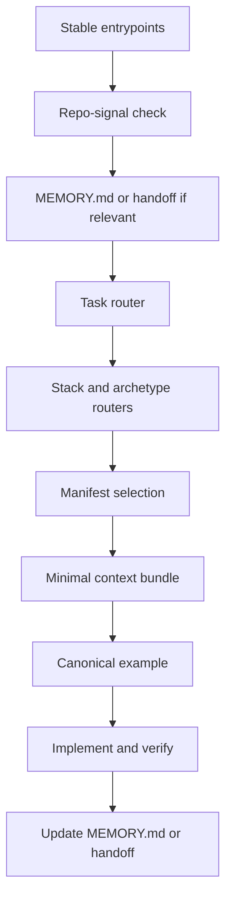

# Context Boot Sequence

This is the deterministic startup contract for assistants working in `agent-context-base` or a repo generated from it.

## Boot Order

1. Read the stable entrypoints:
   `README.md`, `docs/context-boot-sequence.md`, `docs/repo-purpose.md`, `docs/repo-layout.md`, and `docs/session-start.md`.
2. Inspect narrow repo signals:
   lockfiles, root manifests, source entrypoints, Compose files, prompt files, and deployment artifacts.
3. Recover continuity:
   read `MEMORY.md` if it exists, then the latest relevant handoff snapshot only when clearly resuming a transfer.
4. Route the task:
   choose one workflow first, then the active stack and archetype only if needed.
5. Select a manifest:
   prefer the manifest with the strongest repo-signal and router match.
6. Assemble the minimal bundle:
   required context first, optional context only when activated by the task.
7. Choose one canonical example:
   add one support example only for an orthogonal concern such as smoke testing.
8. Implement, verify, and update continuity artifacts at meaningful stop points.

## Runtime Flow



## Rules

- Do not start by scanning whole directories.
- Treat `MEMORY.md` as operational state, not doctrine.
- Stop if more than one workflow, stack, archetype, or manifest still looks primary.
- Do not merge several near-match manifests.
- Do not load templates when a canonical example already answers the implementation question.

## Helpful Commands

```bash
python scripts/prompt_first_repo_analyzer.py .
python scripts/preview_context_bundle.py <manifest> --show-weights --show-anchors
python scripts/validate_context.py
```
