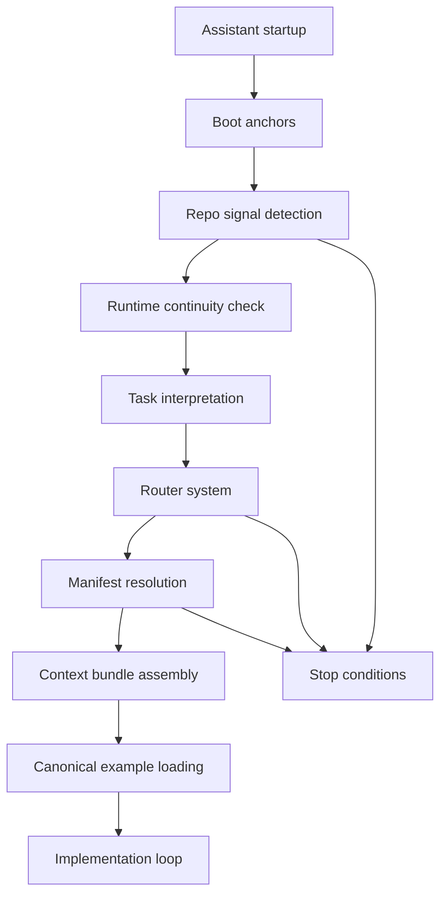

# Context Boot Sequence

The Context Boot Sequence is the deterministic startup contract for assistants operating inside a repo derived from `agent-context-base`.

Its job is simple: make assistant startup behave like runtime initialization instead of ad hoc exploration.

## Section 1 - Boot Sequence Philosophy

Assistants need a boot sequence for the same reason operating systems need process initialization: a stable startup path creates predictable behavior.

Without a boot sequence, assistants tend to load context opportunistically. That causes recurring failures:

- hallucinated architecture because the assistant infers repo structure from a partial or noisy sample
- mixed patterns because examples, templates, and stack conventions get blended without a dominant source of truth
- excessive scanning because the assistant keeps opening files to compensate for weak early assumptions
- inconsistent reasoning because two sessions can start from different files and reach different conclusions
- mid-task continuity loss because the current objective, working set, and next step are not preserved at pause points

A deterministic boot sequence prevents this by forcing a fixed order:

1. establish repo identity
2. infer repo signals
3. recover runtime continuity if present
4. resolve the dominant routing path
5. load one minimal context bundle
6. consult canonical examples before implementation

The result is a predictable assistant runtime:

- smaller context windows
- fewer architectural guesses
- stronger reuse of repo-native patterns
- lower reload cost after interruptions
- cleaner stop conditions when ambiguity remains

## Section 2 - Boot Sequence Mental Model

Use this model:

`Assistant enters repo`
`-> read boot anchors`
`-> detect repo signals`
`-> read MEMORY.md if present`
`-> read latest relevant handoff snapshot only if resuming a transfer`
`-> interpret task`
`-> infer archetype`
`-> infer stack`
`-> consult routers`
`-> select manifest`
`-> assemble context bundle`
`-> consult canonical examples`
`-> begin implementation loop`

Stage summary:

- `read boot anchors`: load small stable reminders before deeper context
- `detect repo signals`: inspect a narrow set of root files and conventional paths
- `read MEMORY.md if present`: recover live task state without treating it as doctrine
- `read latest relevant handoff snapshot only if resuming a transfer`: recover a durable checkpoint for interrupted work
- `interpret task`: map the user request to one primary workflow
- `infer archetype`: decide the repo shape
- `infer stack`: decide the implementation family on the active surface
- `consult routers`: normalize language and signals through router docs and aliases
- `select manifest`: choose the best matching bundle definition
- `assemble context bundle`: load only the required doctrine, workflow, archetype, stack, and example surface
- `consult canonical examples`: choose the dominant implementation reference before writing code
- `begin implementation loop`: plan, implement, verify, update memory at stop points, and refine within doctrine

## Section 3 - Boot Stage Overview Diagram



The diagram shows a gated startup path, not a free-form search loop. Each stage narrows the next stage. If repo signals, routing, or manifest choice remain ambiguous, the assistant should stop instead of compensating by loading more files blindly.

## Section 4 - Boot Stage Definitions

| Stage | Purpose | Inputs | Outputs | Constraints |
| --- | --- | --- | --- | --- |
| `Stage 0 - Boot anchors` | Stabilize startup with compact repo rules. | `README.md`, `docs/context-boot-sequence.md`, boot anchor files. | Shared startup assumptions. | Read only short stable files. Do not open broad context trees yet. |
| `Stage 1 - Repo identity detection` | Determine what kind of repo this is. | Root files, lockfiles, `PROMPTS.md`, Compose files, deployment artifacts. | Candidate stack, archetype, deployment posture, Docker relevance. | Prefer filename and path signals over speculative interpretation. |
| `Stage 2 - Runtime continuity check` | Recover live task state when it exists. | `MEMORY.md`, recent handoff snapshot if clearly relevant. | Current objective, working set, already inspected files, next-step hints. | Treat memory as operational state only. Do not let it replace routing, doctrine, or code inspection. |
| `Stage 3 - Task interpretation` | Decide what the user is asking for. | User request, touched files if known, alias catalog, continuity hints if present. | One primary workflow candidate. | Pick the dominant workflow first. Do not mix several because they sound adjacent. |
| `Stage 4 - Router consultation` | Normalize intent and repo shape. | Task candidate, stack signals, archetype signals, aliases. | Active workflow, stack, archetype. | Use router docs before improvising a new category. |
| `Stage 5 - Manifest selection` | Choose the smallest machine-readable bundle. | Router outputs, `repo_signals`, manifest triggers and aliases. | One manifest or an explicit stop. | Never merge near-match manifests casually. |
| `Stage 6 - Context bundle assembly` | Build the ordered load list. | Manifest `required_context`, filtered `optional_context`, anchors, weights, relevant continuity hints. | Ordered minimal bundle. | Load only what the task can justify. |
| `Stage 7 - Canonical example prioritization` | Choose the dominant implementation pattern. | Manifest `preferred_examples`, `examples/catalog.json`, active workflow, stack, archetype. | One primary example and at most one orthogonal support example. | Do not blend incompatible examples. Do not treat templates as canonical. |
| `Stage 8 - Implementation loop initialization` | Start work with verification defined up front. | Bundle, example, doctrine, workflow, user request. | Plan, verification path, stop conditions, stop-hook expectations. | Verification must match the changed boundary, including smoke or minimal real-infra tests when warranted. |

## Section 5 - Boot Anchors

Boot anchors are the first small files assistants should read before deeper routing or manifest work.

Recommended startup anchors:

- `context/anchors/repo-identity.md`
- `context/anchors/context-loading-principles.md`
- `context/anchors/anti-patterns.md`

Why anchors must stay short and stable:

- they are startup memory, not full doctrine
- they should remain safe to reread in long sessions
- they should not accumulate task-specific detail
- they should change rarely, because unstable anchors destabilize every session

Task-specific anchors may be added later:

- `context/anchors/compose-isolation.md` for Docker-backed infra work
- `context/anchors/prompt-first.md` for prompt-sequence work
- `context/anchors/context-integrity.md` for metadata or validation work

## Section 6 - Repo Signal Detection

Repo signal detection should be narrow and deliberate. The assistant should inspect a small set of strong signals first:

- root manifests and lockfiles
- well-known entrypoints
- prompt-first files
- deployment artifacts
- standard dev and test Compose files
- primary and test env files when local infra matters

Useful sources in this repo:

- `context/router/repo-signal-hints.json`
- `python scripts/prompt_first_repo_analyzer.py .`

Compose signals must trigger these assumptions when Docker-backed infra is relevant:

- keep `docker-compose.yml` and `docker-compose.test.yml` as the standard filenames
- preserve repo-derived Compose `name:` values
- keep host ports explicit and non-default
- keep dev data and test data isolated

## Section 7 - Runtime Continuity Check

After boot anchors and initial repo-signal detection, check for runtime continuity artifacts:

- `MEMORY.md`
- the latest relevant file under `artifacts/handoffs/` or `handoffs/`

Use them to recover:

- current objective
- active working set
- already inspected files
- important findings and decisions already made
- explicit scope boundaries
- next concrete steps

Do not use them to skip:

- router selection
- manifest selection
- doctrine constraints
- code inspection
- prompt-number verification

The continuity check should reduce rescanning cost, not change authority.

## Section 8 - Router Consultation

Routers convert natural-language intent plus repo signals into a minimal context decision.

Router roles:

- `context/router/task-router.md`: maps user intent to the dominant workflow
- `context/router/stack-router.md`: maps framework and file signals to the active stack pack
- `context/router/archetype-router.md`: maps repo shape to the primary archetype
- `context/router/alias-catalog.yaml`: normalizes synonyms and common shorthand

Routing rule:

1. resolve the task first
2. resolve the archetype only if repo shape matters
3. resolve the stack on the touched implementation surface
4. stop if more than one dominant route remains

Continuity artifacts may sharpen routing, but they should never replace it.

## Section 9 - Manifest Resolution

Manifests define context bundles. They are the system's context glue because they connect doctrine, workflows, stacks, archetypes, examples, templates, and repo signals in one machine-readable surface.

Important fields:

- `required_context`: files that must be loaded for the manifest to make sense
- `optional_context`: files that may be loaded only when the task or repo signals require them
- `preferred_examples`: canonical examples that should dominate implementation style
- `triggers` and `aliases`: natural-language hints that help route requests toward the manifest
- `repo_signals`: file and path patterns that make the manifest plausible in the current repo
- `task_hints`: workflows most likely to matter for this manifest
- `warnings`: boundary reminders that should shape verification and scope

Resolution rule:

1. prefer the manifest with the strongest `repo_signals` match
2. break ties with router agreement on workflow, stack, and archetype
3. use manifest warnings and task hints to filter optional context
4. if no manifest dominates, stop and say so explicitly

Operational support:

- context lint: `python scripts/validate_context.py`
- manifest validator: `python scripts/validate_manifests.py`
- context bundle preview: `python scripts/preview_context_bundle.py <manifest> --show-weights --show-anchors`

## Section 10 - Context Bundle Assembly

The final context bundle is constructed from these layers:

1. boot anchors
2. runtime continuity artifacts if present and relevant
3. manifest `required_context`
4. task-activated `optional_context`
5. one primary canonical example
6. one support example only if it covers an orthogonal boundary such as smoke testing
7. templates only if scaffolding is part of the task

Minimal context loading means:

- load the smallest bundle that can explain the change
- do not load unrelated stacks
- do not load all optional context because it exists
- do not load templates when examples already answer the implementation question
- use memory to compress reload cost, not to bypass doctrine or code checks

If the manifest is already known, use:

```bash
python scripts/preview_context_bundle.py <manifest> --show-weights --show-anchors
```

## Section 11 - Canonical Example Loading

Canonical examples shape generated code more strongly than abstract advice. They control naming, structure, surface boundaries, and test shape.

Selection rules:

- prefer examples named in the active manifest's `preferred_examples`
- confirm they match the active workflow, stack, and archetype
- use `examples/catalog.json` to rank close candidates
- choose one dominant implementation example
- add one support example only when it covers a different concern such as smoke tests or observability

If no example fits, say so explicitly and implement the smallest doctrine-consistent solution. Do not promote a template to canonical status just because it is nearby.

## Section 12 - Implementation Loop

After boot completes, the assistant should operate inside a constrained implementation loop:

1. `context review`
   - restate the active workflow, stack, archetype, manifest, and example
2. `implementation planning`
   - define touched files and the minimal verification path
3. `code generation`
   - follow stack and example structure instead of inventing a new pattern
4. `verification against doctrine`
   - check naming, testing, deployment, prompt, and isolation doctrine as applicable
5. `stop-hook update at meaningful pauses`
   - refresh `MEMORY.md`
   - create a handoff snapshot when the pause will likely cross sessions or assistants
6. `refinement`
   - run post-flight cleanup without reopening architecture

## Section 13 - Guardrails And Stop Conditions

Guardrails:

- do not introduce a new framework without a stack pack or explicit extension path
- do not load unrelated stacks just because the repo may support them eventually
- do not rewrite repo architecture when the task only needs a local change
- do not replace canonical examples with improvised patterns
- do not collapse dev and test Compose files into one topology
- do not use memory notes to justify skipping doctrine or verification
- stop when the requested task is satisfied and the verification path passes

Use `context/doctrine/stop-conditions.md` when:

- more than one primary stack remains plausible
- more than one primary archetype remains plausible
- a storage, queue, search, or deployment change has no minimal verification path
- the bundle would grow without a clear dominant manifest

## Section 14 - Boot Sequence Checklist

- Read `README.md` and `docs/context-boot-sequence.md`.
- Read the boot anchors under `context/anchors/`.
- Detect repo signals from root files and standard paths.
- Read `MEMORY.md` if present after stable startup files and repo-signal checks.
- Read the latest relevant handoff snapshot only when resuming a real transfer.
- Interpret the user task into one primary workflow.
- Consult task, stack, archetype, and alias routers.
- Select one manifest.
- Preview and assemble the smallest context bundle.
- Load one dominant canonical example.
- Start the implementation loop with verification defined.

## Section 15 - Failure Mode Mitigation

| Failure Mode | Boot Sequence Mitigation |
| --- | --- |
| Overloading context | Startup is stage-gated and manifest-driven instead of scan-driven. |
| Mid-task continuity loss | `MEMORY.md` and handoff snapshots recover live task state without replacing routing or doctrine. |
| Architecture hallucination | Repo identity and signal detection happen before stack-specific reasoning. |
| Example blending | Canonical example selection happens after manifest resolution and prefers one dominant example. |
| Framework drift | Stack router and manifest selection keep implementation on supported patterns. |
| Testing gaps | The implementation loop requires smoke tests and minimal real-infra tests when the boundary justifies them. |
| Inconsistent reasoning across sessions | Boot anchors and ordered stages make startup repeatable. |

## Section 16 - Integration With AGENT.md And CLAUDE.md

`AGENT.md` and `CLAUDE.md` should reference the boot sequence as the startup contract, not duplicate it.

Recommended lines:

```md
Follow `docs/context-boot-sequence.md` as the deterministic startup contract for this repo.
```

```md
After the stable startup files and repo-signal checks, read `MEMORY.md` if it exists.
```

They should also tell assistants to refresh `MEMORY.md` at major stop points and create handoff snapshots when meaningful progress is likely to cross sessions.

Their job is to route the assistant into this document, then into the smallest relevant bundle. They should remain short and avoid re-embedding all doctrine.

## Section 17 - Final Mental Model

Boot anchors stabilize understanding.  
Repo signals identify the active shape.  
Runtime continuity artifacts reduce reload cost.  
Routers infer intent.  
Manifests assemble context.  
Doctrine constrains behavior.  
Examples shape implementation.  
Stop hooks preserve continuity.  
Verification closes the loop.
