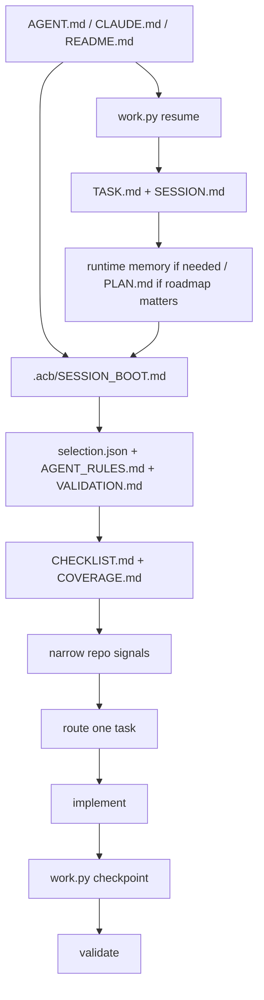

# Context Boot Sequence

This is the deterministic startup contract for assistants working in `agent-context-base` or a generated repo.

## Boot Order

1. Read stable entrypoints: `AGENT.md`, `CLAUDE.md`, and `README.md` when present.
2. Run `python3 scripts/work.py resume` when the repo has a root `scripts/` directory. In compact derived repos without a root `scripts/` directory, run `python3 .acb/scripts/work.py resume`.
3. Read `context/TASK.md` and `context/SESSION.md` when they exist. Read `context/MEMORY.md` only if durable repo-local truths matter. Read `PLAN.md` when milestone context matters.
4. In generated repos, read `.acb/SESSION_BOOT.md`, `.acb/profile/selection.json`, `.acb/specs/AGENT_RULES.md`, and `.acb/specs/VALIDATION.md`.
5. Read `.acb/validation/CHECKLIST.md` and `.acb/validation/COVERAGE.md` when `.acb/` exists.
6. Inspect narrow repo signals: lockfiles, root manifests, source entrypoints, Compose files, prompt files, deployment artifacts.
7. Route the task and load only the active workflow, stack surface, archetype, and canonical example.

## Rules

- Do not start by scanning whole directories.
- Re-read `.acb/` at the beginning of every new session.
- Use repo-local runtime markdown files for continuation state, not doctrine.
- Keep `context/SESSION.md` concise and action-oriented.
- Update `PLAN.md` only when phases or milestones changed materially.
- Prefer one active boundary and one validation path.
- Treat validation as required before claiming completion.
- Use `blocked`, `incomplete`, and `done` precisely.

## Diagram

