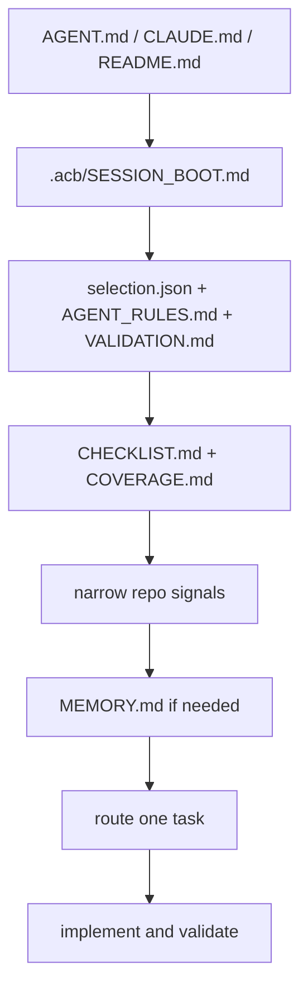

# Context Boot Sequence

This is the deterministic startup contract for assistants working in `agent-context-base` or a generated repo.

## Boot Order

1. Read stable entrypoints: `AGENT.md`, `CLAUDE.md`, and `README.md` when present.
2. In generated repos, read `.acb/SESSION_BOOT.md`, `.acb/profile/selection.json`, `.acb/specs/AGENT_RULES.md`, and `.acb/specs/VALIDATION.md`.
3. Read `.acb/validation/CHECKLIST.md` and `.acb/validation/COVERAGE.md` when `.acb/` exists.
4. Inspect narrow repo signals: lockfiles, root manifests, source entrypoints, Compose files, prompt files, deployment artifacts.
5. Read `MEMORY.md` only after the stable startup surface was rehydrated.
6. Route the task and load only the active workflow, stack surface, archetype, and canonical example.

## Rules

- Do not start by scanning whole directories.
- Re-read `.acb/` at the beginning of every new session.
- Prefer one active boundary and one validation path.
- Treat validation as required before claiming completion.
- Use `blocked`, `incomplete`, and `done` precisely.

## Diagram

