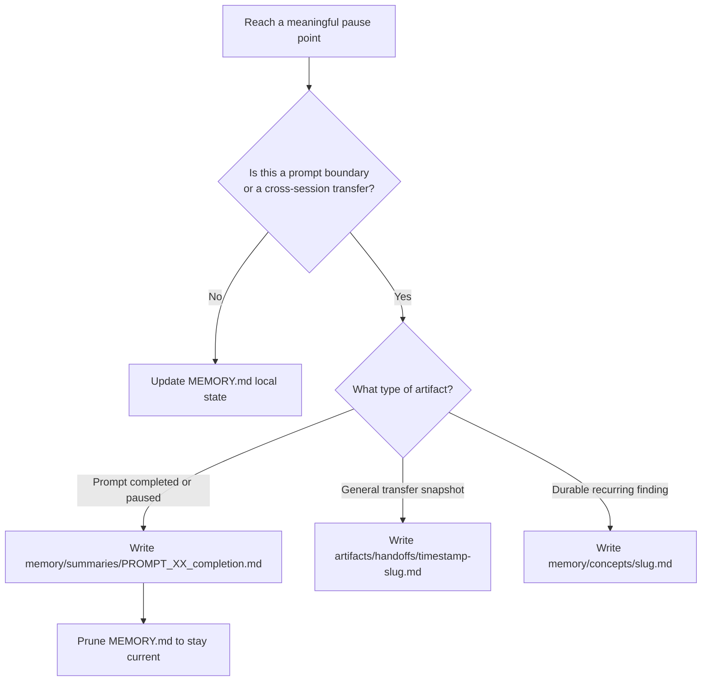

# Memory Layer Overview

The memory layer exists to preserve live task state without turning continuity artifacts
into another source of architectural truth.

## What It Solves

Without a continuity layer, assistants tend to:

- rescan the same files after interruptions
- forget which decisions were already made
- lose the next concrete step
- blur prompt-first sequencing across sessions

## Artifact Roles

| Artifact | Scope | Mutability | Purpose |
|----------|-------|------------|---------|
| `context/MEMORY.md` | local, gitignored | mutable | current-task live state |
| `memory/summaries/` | committed | immutable once written | prompt-boundary checkpoints |
| `memory/concepts/` | committed | slow-changing | durable recurring knowledge |
| `memory/sessions/` | committed | append-only | session logs and exploration traces |
| `artifacts/handoffs/` | committed | immutable once written | general timestamped transfer snapshots |

## Decision Flow

## Load Priority For Fresh Sessions

1. `memory/INDEX.md` — orientation, after `work.py resume`
2. `memory/summaries/PROMPT_XX_*.md` — context for the specific prompt being resumed
3. `memory/concepts/` — when working in a known domain
4. `artifacts/handoffs/` — when the task involves a general cross-session transfer
5. `context/MEMORY.md` — live state if present

## Operating Rule

Update `context/MEMORY.md` at meaningful pause points during active work. Write a summary
to `memory/summaries/` at each prompt boundary. Promote durable findings to
`memory/concepts/` when they will recur.

See `context/doctrine/memory-compaction-discipline.md` for the full compaction model.
