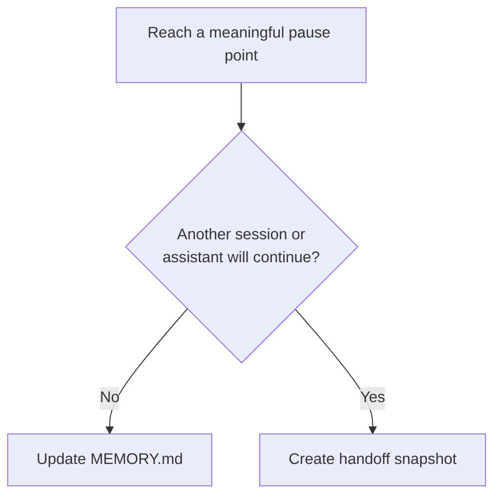

# Memory Layer Overview

The memory layer exists to preserve live task state without turning continuity artifacts into another source of architectural truth.

## What It Solves

Without a continuity layer, assistants tend to:

- rescan the same files after interruptions
- forget which decisions were already made
- lose the next concrete step
- blur prompt-first sequencing across sessions

## Artifact Roles

- `MEMORY.md`: mutable current-task state
- handoff snapshot: durable point-in-time transfer artifact
- `context/memory/`: stable rules and templates for using both safely

## What `MEMORY.md` Should Contain

- current objective
- active working set
- important findings and decisions
- explicit non-goals when scope control matters
- validation status
- next concrete step

## What It Must Not Become

- doctrine
- a manifest replacement
- a codebase summary dump
- a full transcript
- a backlog of unrelated future ideas

## Operating Rule

Update `MEMORY.md` at meaningful pause points. Create a handoff snapshot when the work is likely to continue in a fresh session, prompt run, or by another person or assistant.

The decision turns on whether the next session is a continuation by the same assistant or a transfer to a new one.

Used well, the memory layer reduces reload cost. It does not increase authority.
