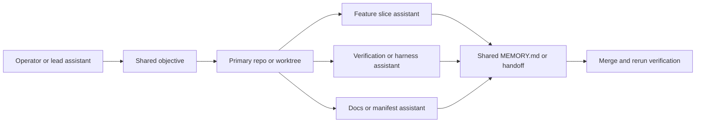

# Advanced Assistant Operations

Use this guide after the repo already exists and the work is likely to span multiple slices, sessions, or assistants.

## Long-Running Sessions

The safest rhythm is:

`route narrowly -> implement one slice -> verify -> checkpoint -> continue only if the next slice is still clear`

Rules:

- define the verification path before coding
- prefer vertical slices over broad horizontal rewrites
- checkpoint after each meaningful slice
- restart fresh when the active context becomes crowded or the task boundary changes

## Continuity Discipline

Update `MEMORY.md` at meaningful stop points, not after every command. It should answer:

- what is the current objective
- what files are active
- what was verified
- what remains risky
- what exact next step comes next

Create a handoff snapshot when another session or another assistant is likely to continue the work.

## Multi-Agent Pattern

Parallel assistants should divide by boundary, not by random file ownership.

Practical rules:

- assign one clear concern per assistant or worktree
- keep shared continuity artifacts concise
- merge only after the slice and its verification path are clear
- avoid having several assistants invent architecture at once

## Cross-Repo Coordination

Keep repo roles explicit:

- `agent-context-base` is for guidance, manifests, examples, and bootstrap
- the generated repo is for product implementation

If you need to touch both, finish the base change first or capture a precise handoff that states which repo owns which next step.

## Higher-Autonomy Work

More autonomy is acceptable only when:

- the workflow, stack, and verification path are already clear
- the slice is reviewable
- the repo has a credible smoke or harness path
- stop conditions are explicit

When those are not true, switch back to a narrower, more interactive loop instead of pushing forward.
