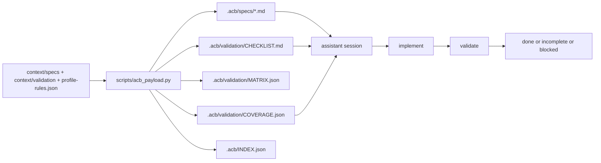
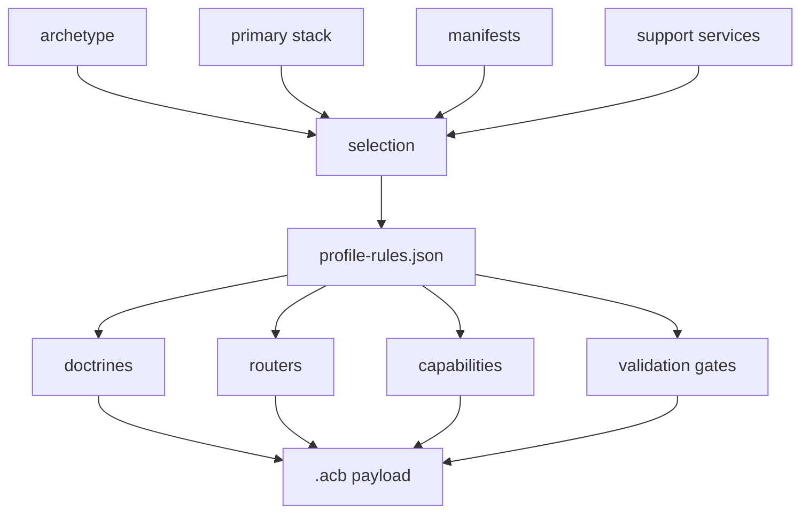

# Spec-Driven `.acb` Payloads

Generated repos receive a repo-local `.acb/` payload so future assistant sessions can operate from explicit local specs, validation rules, and startup guidance instead of rediscovering intent from scratch.

## Purpose

`.acb/` answers these questions locally inside a generated repo:

- what kind of repo is this
- which canonical rules were composed into it
- what must be validated before a slice is complete
- what should a fresh assistant read first
- whether the local payload or upstream canonical sources have drifted
- which validation dimensions are covered and which are still gaps

## Canonical Sources

Canonical inputs live here:

- [`context/specs/`](../../context/specs/README.md)
- [`context/validation/`](../../context/validation/README.md)
- [`context/acb/profile-rules.json`](../../context/acb/profile-rules.json)

Every spec and validation module that can be composed into `.acb/` now carries lightweight origin metadata:

```yaml
---
acb_origin: canonical
acb_source_path: context/specs/architecture/stacks/go-echo.md
acb_role: architecture
acb_stacks: [go-echo]
acb_version: 1
---
```

## Generated `.acb/` Layout

```text
.acb/
  README.md
  SESSION_BOOT.md
  INDEX.json
  profile/
    selection.json
  specs/
    PRODUCT.md
    ARCHITECTURE.md
    AGENT_RULES.md
    VALIDATION.md
    EVOLUTION.md
  validation/
    CHECKLIST.md
    MATRIX.json
    COVERAGE.md
    COVERAGE.json
  doctrines/
    ACTIVE_DOCTRINES.md
  routers/
    README.md
  scripts/
    acb_inspect.py
    acb_verify.py
```

## Real Flow



## Composition Rules

1. `scripts/new_repo.py` or `scripts/acb_payload.py` selects archetype, primary stack, manifests, and support services.
2. `context/acb/profile-rules.json` infers doctrines, routers, capabilities, and validation gates.
3. Canonical modules are selected from `context/specs/` and `context/validation/`.
4. The selected modules are concatenated into `.acb/specs/*.md`.
5. Origin metadata is preserved per canonical module inside the composed output and in `.acb/INDEX.json`.
6. Validation gates become `.acb/validation/CHECKLIST.md` and `.acb/validation/MATRIX.json`.
7. Coverage expectations become `.acb/validation/COVERAGE.md` and `.acb/validation/COVERAGE.json`.

## Drift Detection

Drift detection is intentionally lightweight and inspectable.

`.acb/INDEX.json` records:

- generated file hashes for repo-local payload files
- canonical source paths and canonical source hashes
- the composition target for each source module

`python .acb/scripts/acb_verify.py` reports:

- local payload drift: `.acb/` files changed since generation
- canonical source drift: current canonical files no longer match recorded source hashes, when the base repo is available
- coverage gaps: required validation dimensions not covered by the generated validation gates

This is visibility tooling, not a full enforcement framework.

## Coverage Model

Coverage is profile-aware, not perfectionist. The generated coverage summary answers:

- are the expected spec documents present
- if the repo has `api`, `cli`, `storage`, `frontend`, `workers`, `pipelines`, `eventing`, `scraping`, `rag`, or deployment capabilities, do validation gates cover them
- do archetype-specific concerns such as ingestion replay, service seams, or sync orchestration appear

That summary lives in:

- `.acb/validation/COVERAGE.md`
- `.acb/validation/COVERAGE.json`

## Assistant First-Read Order In A Generated Repo

1. `AGENT.md`
2. `CLAUDE.md`
3. `.acb/SESSION_BOOT.md`
4. `.acb/profile/selection.json`
5. `.acb/specs/AGENT_RULES.md`
6. `.acb/specs/VALIDATION.md`
7. `.acb/validation/CHECKLIST.md`
8. `.acb/validation/COVERAGE.md`
9. `.acb/generation-report.json`
10. vendored manifests or support docs only when the task activates them

## Commands

Compose directly:

```bash
python scripts/acb_payload.py \
  --archetype backend-api-service \
  --primary-stack python-fastapi-uv-ruff-orjson-polars \
  --manifest backend-api-fastapi-polars \
  --support-service postgres \
  --output-dir /tmp/analytics-api
```

Inspect the payload in a generated repo:

```bash
python .acb/scripts/acb_inspect.py
python .acb/scripts/acb_verify.py
```

## Composition Diagram



## What Is Intentionally Lightweight

- drift is reported, not auto-reconciled
- coverage reports expectations, not full semantic completeness
- composition is a readable script, not a framework
- canonical drift checks are optional when the base repo is unavailable
